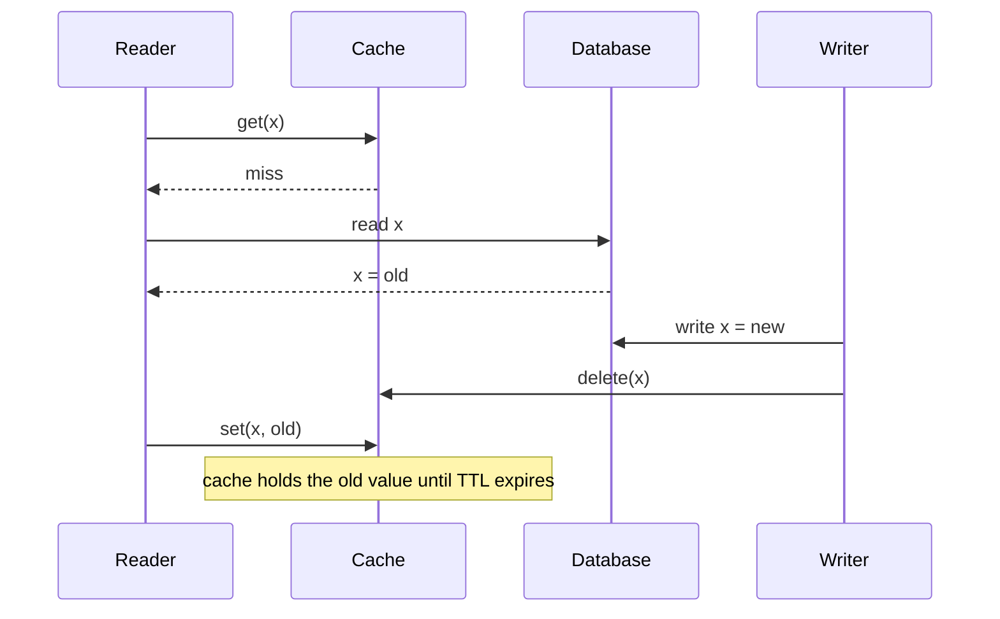

# Cache-aside invalidation race

Source: [Chapter 18](../chapters/18-caching-and-load-balancing.md). Relevant chapters: 18.

```mermaid
sequenceDiagram
  participant R as Reader
  participant C as Cache
  participant DB as Database
  participant W as Writer
  R->>C: get(x)
  C-->>R: miss
  R->>DB: read x
  DB-->>R: x = old
  W->>DB: write x = new
  W->>C: delete(x)
  R->>C: set(x, old)
  Note over C: cache holds the old value until TTL expires
```
