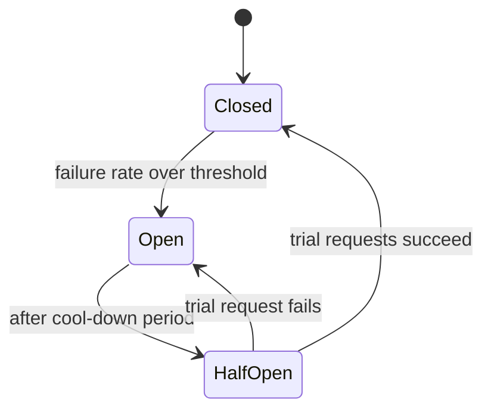

# Circuit breaker states

Source: [Chapter 17](../chapters/17-resilience.md). Relevant chapters: 17.

```mermaid
stateDiagram-v2
  [*] --> Closed
  Closed --> Open: failure rate over threshold
  Open --> HalfOpen: after cool-down period
  HalfOpen --> Closed: trial requests succeed
  HalfOpen --> Open: trial request fails
```
