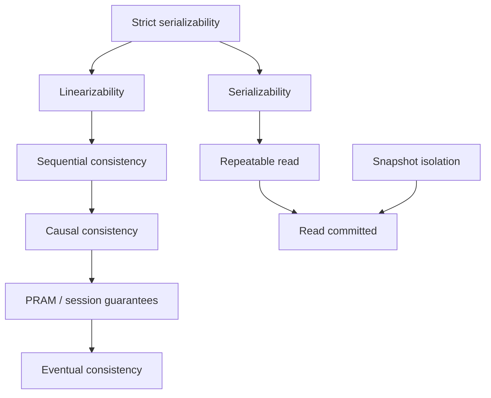

# Hierarchy of consistency and isolation models

Source: [Chapter 8](../chapters/08-consistency-models.md). Relevant chapters: 8, 9.

```mermaid
flowchart TB
  SS["Strict serializability"] --> SER["Serializability"]
  SS --> LIN["Linearizability"]
  LIN --> SEQ["Sequential consistency"]
  SEQ --> CAU["Causal consistency"]
  CAU --> PRAM["PRAM / session guarantees"]
  PRAM --> EV["Eventual consistency"]
  SER --> RR["Repeatable read"]
  RR --> RC["Read committed"]
  SI["Snapshot isolation"] --> RC
```
