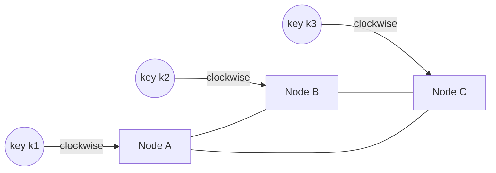

# Consistent hashing ring

Source: [Chapter 7](../chapters/07-partitioning.md). Relevant chapters: 7.

```mermaid
flowchart LR
  K1(("key k1")) -- "clockwise" --> A["Node A"]
  K2(("key k2")) -- "clockwise" --> B["Node B"]
  K3(("key k3")) -- "clockwise" --> C["Node C"]
  A --- B --- C --- A
```
