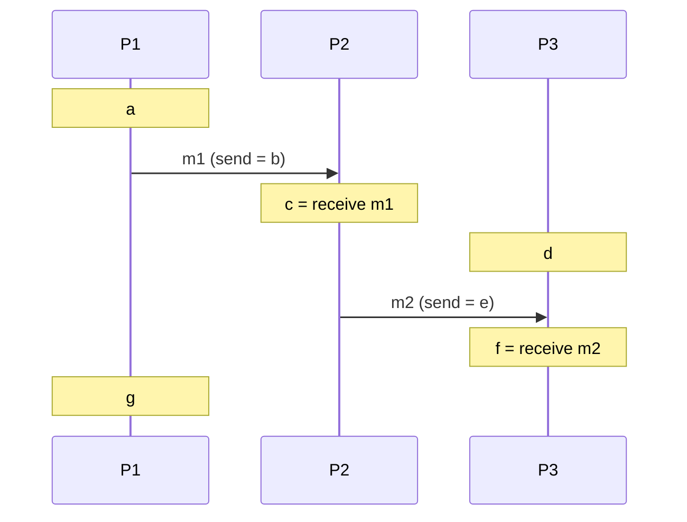

# Happened-before across three processes

Source: [Chapter 3](../chapters/03-time-and-order.md). Relevant chapters: 3.

```mermaid
sequenceDiagram
  participant P1
  participant P2
  participant P3
  Note over P1: a
  P1->>P2: m1 (send = b)
  Note over P2: c = receive m1
  Note over P3: d
  P2->>P3: m2 (send = e)
  Note over P3: f = receive m2
  Note over P1: g
```
