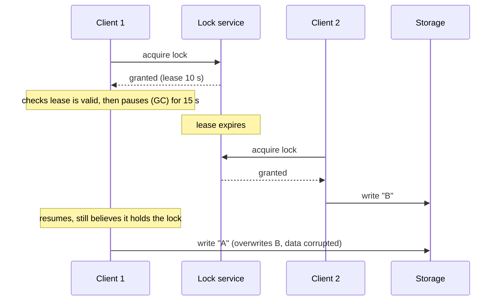

# A paused lock holder corrupts storage without fencing

Source: [Chapter 12](../chapters/12-coordination.md). Relevant chapters: 12.

```mermaid
sequenceDiagram
  participant C1 as Client 1
  participant L as Lock service
  participant C2 as Client 2
  participant S as Storage
  C1->>L: acquire lock
  L-->>C1: granted (lease 10 s)
  Note over C1: checks lease is valid, then pauses (GC) for 15 s
  Note over L: lease expires
  C2->>L: acquire lock
  L-->>C2: granted
  C2->>S: write "B"
  Note over C1: resumes, still believes it holds the lock
  C1->>S: write "A" (overwrites B, data corrupted)
```
