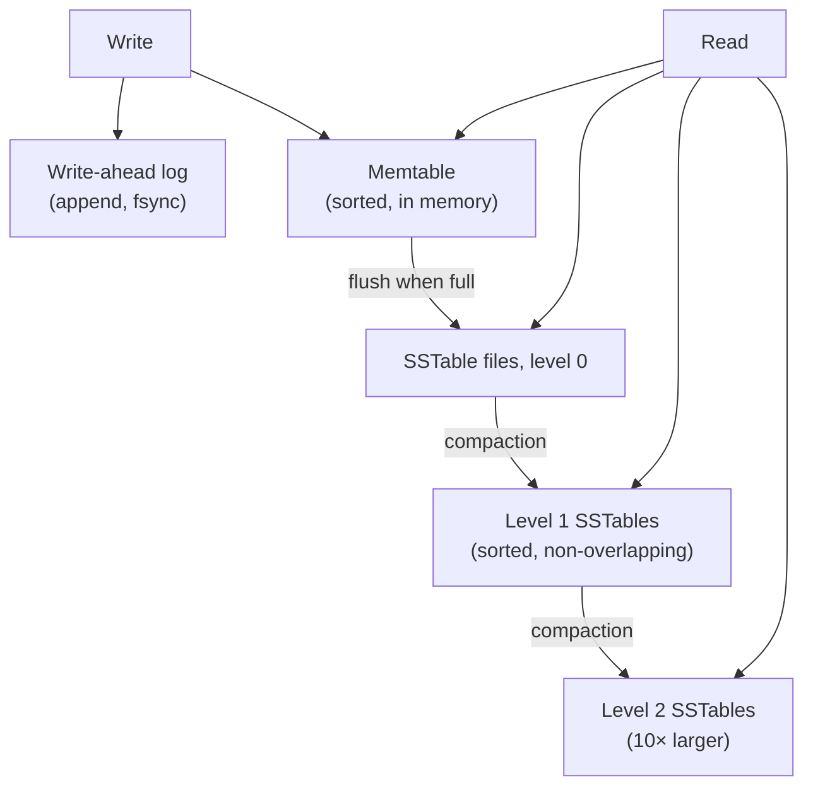

# Log-structured merge tree

Source: [Chapter 15](../chapters/15-storage-engines.md). Relevant chapters: 15.

```mermaid
flowchart TB
  W["Write"] --> WAL["Write-ahead log<br/>(append, fsync)"]
  W --> MT["Memtable<br/>(sorted, in memory)"]
  MT -- "flush when full" --> L0["SSTable files, level 0"]
  L0 -- "compaction" --> L1["Level 1 SSTables<br/>(sorted, non-overlapping)"]
  L1 -- "compaction" --> L2["Level 2 SSTables<br/>(10× larger)"]
  R["Read"] --> MT
  R --> L0
  R --> L1
  R --> L2
```
