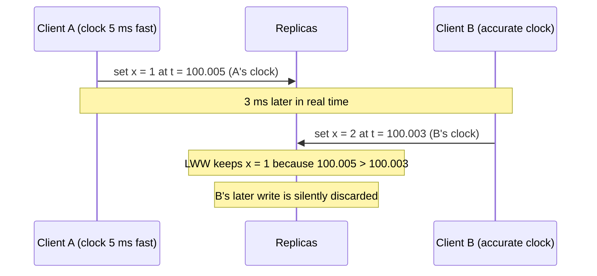

# Last write wins loses data under clock skew

Source: [Chapter 3](../chapters/03-time-and-order.md). Relevant chapters: 3, 6.

```mermaid
sequenceDiagram
  participant A as Client A (clock 5 ms fast)
  participant R as Replicas
  participant B as Client B (accurate clock)
  A->>R: set x = 1 at t = 100.005 (A's clock)
  Note over A,B: 3 ms later in real time
  B->>R: set x = 2 at t = 100.003 (B's clock)
  Note over R: LWW keeps x = 1 because 100.005 > 100.003
  Note over R: B's later write is silently discarded
```
