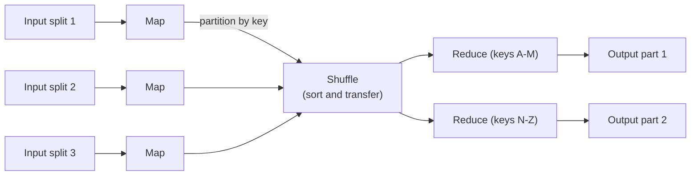

# MapReduce dataflow

Source: [Chapter 16](../chapters/16-batch-and-stream.md). Relevant chapters: 16.

```mermaid
flowchart LR
  I1["Input split 1"] --> M1["Map"]
  I2["Input split 2"] --> M2["Map"]
  I3["Input split 3"] --> M3["Map"]
  M1 -- "partition by key" --> S["Shuffle<br/>(sort and transfer)"]
  M2 --> S
  M3 --> S
  S --> R1["Reduce (keys A-M)"]
  S --> R2["Reduce (keys N-Z)"]
  R1 --> O1["Output part 1"]
  R2 --> O2["Output part 2"]
```
