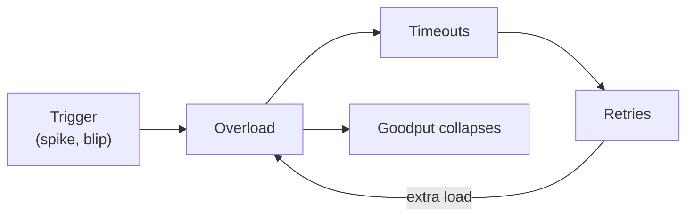

# The metastable retry loop

Source: [Chapter 17](../chapters/17-resilience.md). Relevant chapters: 17, 24.

```mermaid
flowchart LR
  T["Trigger<br/>(spike, blip)"] --> O["Overload"]
  O --> TO["Timeouts"]
  TO --> RT["Retries"]
  RT -- "extra load" --> O
  O --> GP["Goodput collapses"]
```
