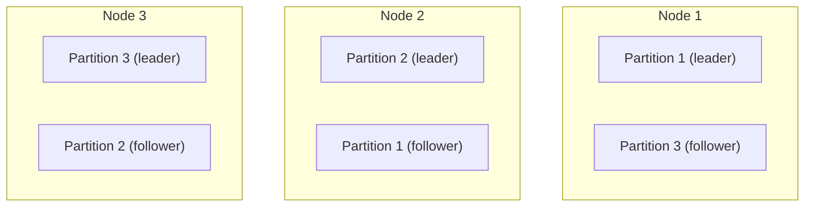

# Partitions and their replicas across nodes

Source: [Chapter 7](../chapters/07-partitioning.md). Relevant chapters: 7.

```mermaid
flowchart TB
  subgraph Node1["Node 1"]
    P1L["Partition 1 (leader)"]
    P3F["Partition 3 (follower)"]
  end
  subgraph Node2["Node 2"]
    P2L["Partition 2 (leader)"]
    P1F["Partition 1 (follower)"]
  end
  subgraph Node3["Node 3"]
    P3L["Partition 3 (leader)"]
    P2F["Partition 2 (follower)"]
  end
```
