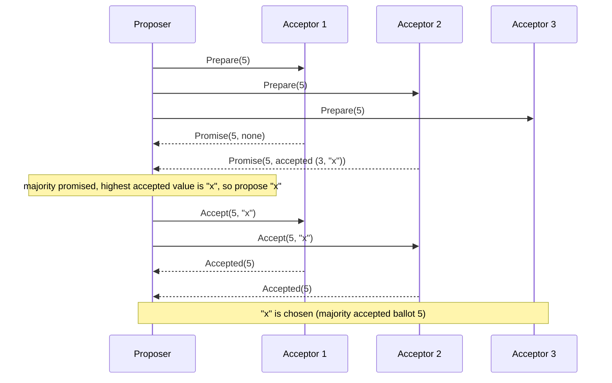

# Single-decree Paxos

Source: [Chapter 11](../chapters/11-consensus.md). Relevant chapters: 11.

```mermaid
sequenceDiagram
  participant P as Proposer
  participant A1 as Acceptor 1
  participant A2 as Acceptor 2
  participant A3 as Acceptor 3
  P->>A1: Prepare(5)
  P->>A2: Prepare(5)
  P->>A3: Prepare(5)
  A1-->>P: Promise(5, none)
  A2-->>P: Promise(5, accepted (3, "x"))
  Note over P: majority promised, highest accepted value is "x", so propose "x"
  P->>A1: Accept(5, "x")
  P->>A2: Accept(5, "x")
  A1-->>P: Accepted(5)
  A2-->>P: Accepted(5)
  Note over P,A3: "x" is chosen (majority accepted ballot 5)
```
