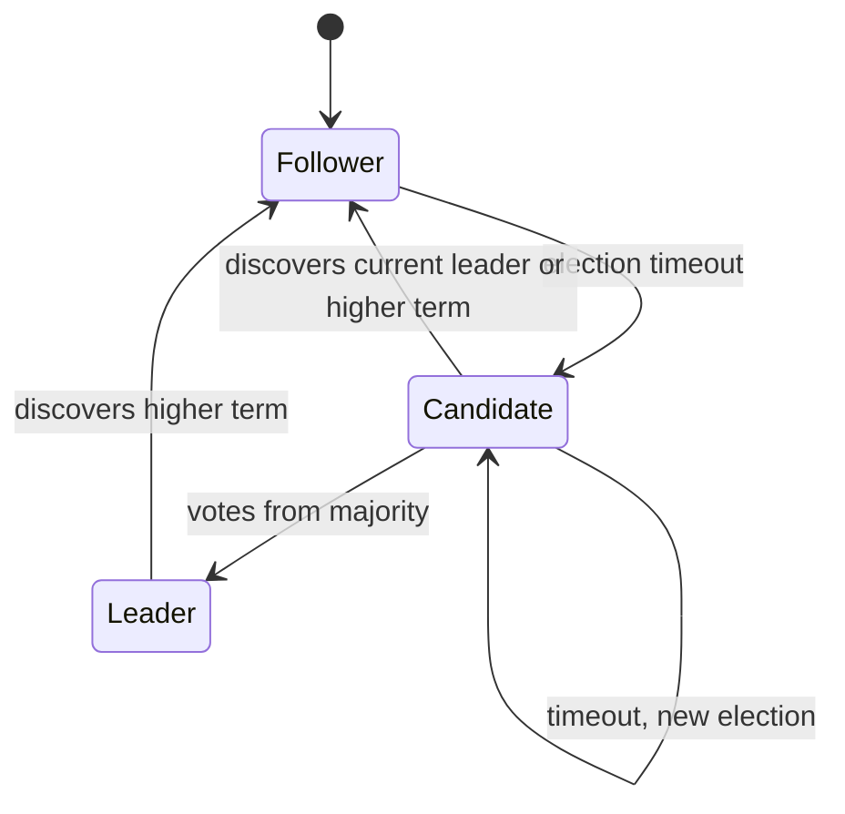

# Raft server states

Source: [Chapter 11](../chapters/11-consensus.md). Relevant chapters: 11.

```mermaid
stateDiagram-v2
  [*] --> Follower
  Follower --> Candidate: election timeout
  Candidate --> Candidate: timeout, new election
  Candidate --> Leader: votes from majority
  Candidate --> Follower: discovers current leader or higher term
  Leader --> Follower: discovers higher term
```
