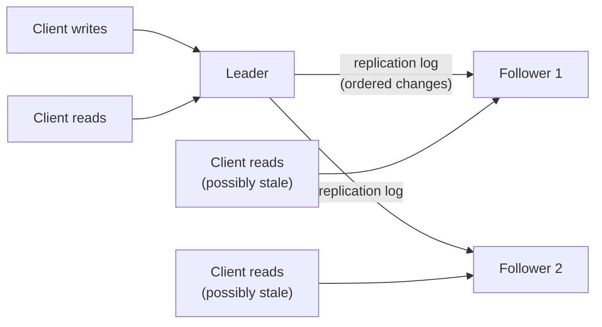

# Single-leader replication

Source: [Chapter 6](../chapters/06-replication.md). Relevant chapters: 6.

```mermaid
flowchart LR
  C1["Client writes"] --> L["Leader"]
  L -- "replication log<br/>(ordered changes)" --> F1["Follower 1"]
  L -- "replication log" --> F2["Follower 2"]
  C2["Client reads"] --> L
  C3["Client reads<br/>(possibly stale)"] --> F1
  C4["Client reads<br/>(possibly stale)"] --> F2
```
