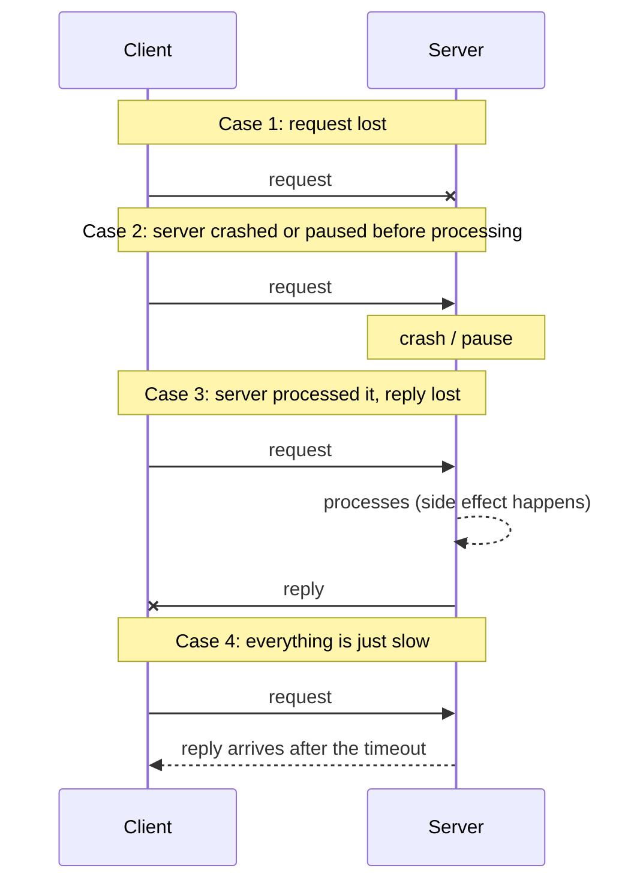

# Four failures that look identical to a timeout

Source: [Chapter 2](../chapters/02-networks-and-failure.md). Relevant chapters: 2, 14.

```mermaid
sequenceDiagram
  participant C as Client
  participant S as Server
  Note over C,S: Case 1: request lost
  C-xS: request
  Note over C,S: Case 2: server crashed or paused before processing
  C->>S: request
  Note over S: crash / pause
  Note over C,S: Case 3: server processed it, reply lost
  C->>S: request
  S-->>S: processes (side effect happens)
  S-xC: reply
  Note over C,S: Case 4: everything is just slow
  C->>S: request
  S-->>C: reply arrives after the timeout
```
