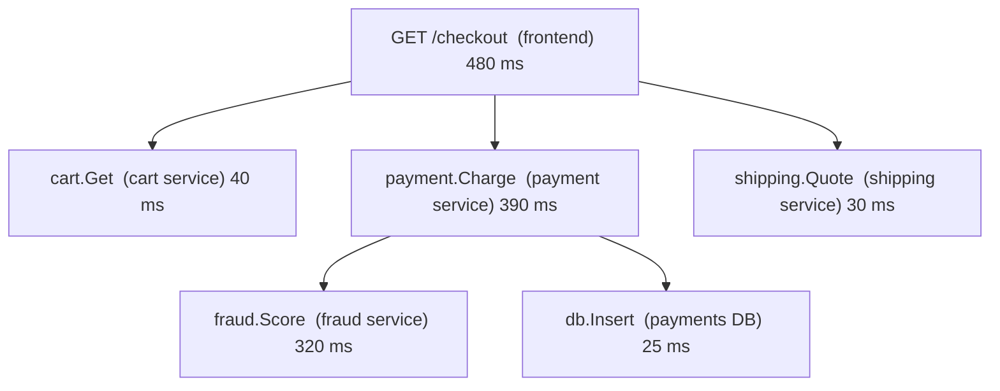

# A distributed trace as a tree of spans

Source: [Chapter 22](../chapters/22-observability.md). Relevant chapters: 22.

```mermaid
flowchart TB
  A["GET /checkout  (frontend) 480 ms"] --> B["cart.Get  (cart service) 40 ms"]
  A --> C["payment.Charge  (payment service) 390 ms"]
  C --> D["fraud.Score  (fraud service) 320 ms"]
  C --> E["db.Insert  (payments DB) 25 ms"]
  A --> F["shipping.Quote  (shipping service) 30 ms"]
```
