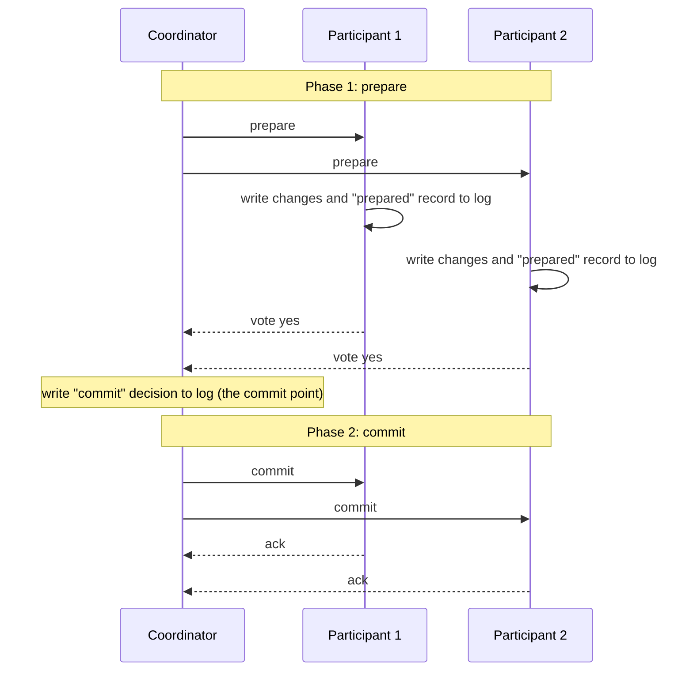

# Two-phase commit

Source: [Chapter 9](../chapters/09-distributed-transactions.md). Relevant chapters: 9.

```mermaid
sequenceDiagram
  participant C as Coordinator
  participant P1 as Participant 1
  participant P2 as Participant 2
  Note over C,P2: Phase 1: prepare
  C->>P1: prepare
  C->>P2: prepare
  P1->>P1: write changes and "prepared" record to log
  P2->>P2: write changes and "prepared" record to log
  P1-->>C: vote yes
  P2-->>C: vote yes
  Note over C: write "commit" decision to log (the commit point)
  Note over C,P2: Phase 2: commit
  C->>P1: commit
  C->>P2: commit
  P1-->>C: ack
  P2-->>C: ack
```
