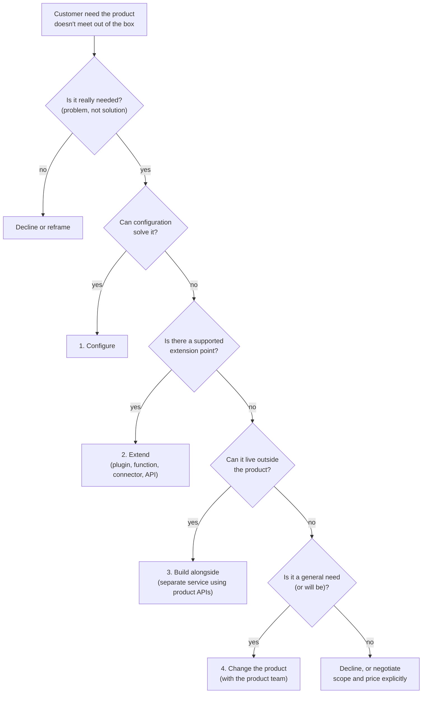

# Configure, extend, build alongside or change the product

Source: [Chapter 11](../chapters/11-configure-extend-change.md). Relevant chapters: 11.

```mermaid
flowchart TB
  Q["Customer need the product<br/>doesn't meet out of the box"] --> R0{"Is it really needed?<br/>(problem, not solution)"}
  R0 -- no --> D0["Decline or reframe"]
  R0 -- yes --> R1{"Can configuration<br/>solve it?"}
  R1 -- yes --> C1["1. Configure"]
  R1 -- no --> R2{"Is there a supported<br/>extension point?"}
  R2 -- yes --> C2["2. Extend<br/>(plugin, function, connector, API)"]
  R2 -- no --> R3{"Can it live outside<br/>the product?"}
  R3 -- yes --> C3["3. Build alongside<br/>(separate service using product APIs)"]
  R3 -- no --> R4{"Is it a general need<br/>(or will be)?"}
  R4 -- yes --> C4["4. Change the product<br/>(with the product team)"]
  R4 -- no --> D1["Decline, or negotiate<br/>scope and price explicitly"]
```
