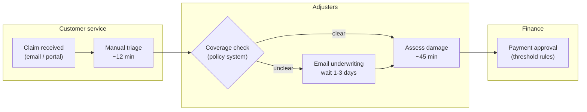

# Current-state workflow map (claims example)

Source: [Chapter 5](../chapters/05-discovery-and-decomposition.md). Relevant chapters: 5.

```mermaid
flowchart LR
  subgraph Customer_service["Customer service"]
    A["Claim received<br/>(email / portal)"] --> B["Manual triage<br/>~12 min"]
  end
  subgraph Adjusters
    B --> C{"Coverage check<br/>(policy system)"}
    C -- unclear --> D["Email underwriting<br/>wait 1-3 days"]
    C -- clear --> E["Assess damage<br/>~45 min"]
    D --> E
  end
  subgraph Finance
    E --> F["Payment approval<br/>(threshold rules)"]
  end
```
