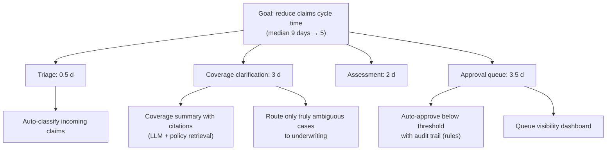

# Problem decomposition tree (claims example)

Source: [Chapter 5](../chapters/05-discovery-and-decomposition.md). Relevant chapters: 5, 20.

```mermaid
flowchart TB
  G["Goal: reduce claims cycle time<br/>(median 9 days → 5)"] --> T1["Triage: 0.5 d"]
  G --> T2["Coverage clarification: 3 d"]
  G --> T3["Assessment: 2 d"]
  G --> T4["Approval queue: 3.5 d"]
  T2 --> S1["Coverage summary with citations<br/>(LLM + policy retrieval)"]
  T2 --> S2["Route only truly ambiguous cases<br/>to underwriting"]
  T4 --> S3["Auto-approve below threshold<br/>with audit trail (rules)"]
  T4 --> S4["Queue visibility dashboard"]
  T1 --> S5["Auto-classify incoming claims"]
```
