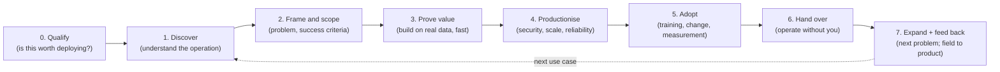

# The engagement lifecycle

Source: [Chapter 4](../chapters/04-engagement-lifecycle.md). Relevant chapters: 4.

```mermaid
flowchart LR
  P0["0. Qualify<br/>(is this worth deploying?)"] --> P1["1. Discover<br/>(understand the operation)"]
  P1 --> P2["2. Frame and scope<br/>(problem, success criteria)"]
  P2 --> P3["3. Prove value<br/>(build on real data, fast)"]
  P3 --> P4["4. Productionise<br/>(security, scale, reliability)"]
  P4 --> P5["5. Adopt<br/>(training, change, measurement)"]
  P5 --> P6["6. Hand over<br/>(operate without you)"]
  P6 --> P7["7. Expand + feed back<br/>(next problem; field to product)"]
  P7 -. next use case .-> P1
```
