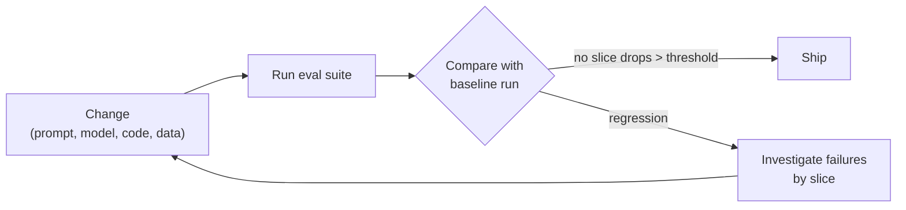

# Evaluations as regression tests

Source: [Chapter 13](../chapters/13-evaluation-and-impact.md). Relevant chapters: 13.

```mermaid
flowchart LR
  C["Change<br/>(prompt, model, code, data)"] --> R["Run eval suite"]
  R --> Cmp{"Compare with<br/>baseline run"}
  Cmp -- "no slice drops > threshold" --> Ship["Ship"]
  Cmp -- "regression" --> Inv["Investigate failures<br/>by slice"]
  Inv --> C
```
