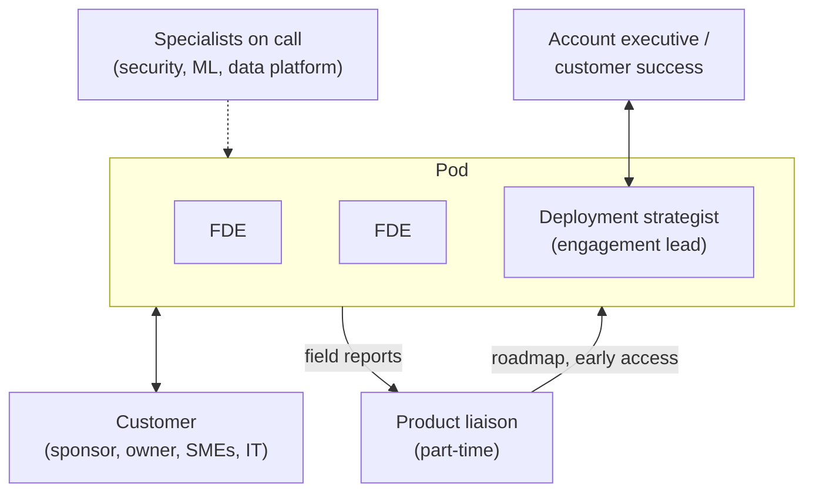

# An FDE pod

Relevant chapter: [17](../chapters/17-running-an-fde-org.md).

```mermaid
flowchart TB
  C["Customer<br/>(sponsor, owner, SMEs, IT)"]
  subgraph Pod["Pod"]
    F1["FDE"]
    F2["FDE"]
    S["Deployment strategist<br/>(engagement lead)"]
  end
  PL["Product liaison<br/>(part-time)"]
  AE["Account executive /<br/>customer success"]
  SP["Specialists on call<br/>(security, ML, data platform)"]
  Pod <--> C
  Pod -- "field reports" --> PL
  PL -- "roadmap, early access" --> Pod
  AE <--> S
  SP -.-> Pod
```
