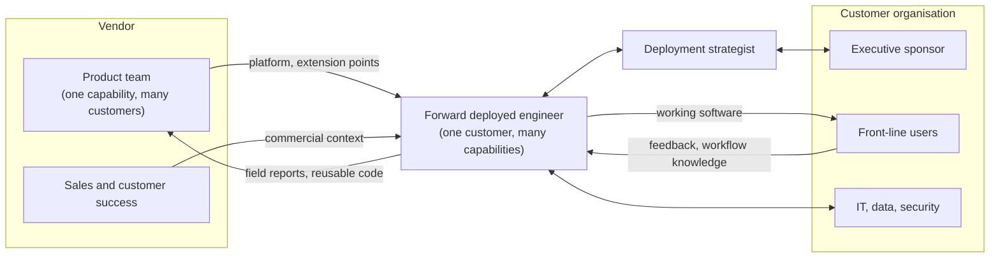

# Where the FDE sits

Relevant chapters: [1](../chapters/01-the-role.md), [16](../chapters/16-field-to-product.md).

```mermaid
flowchart LR
  subgraph Vendor["Vendor"]
    PT["Product team<br/>(one capability, many customers)"]
    SA["Sales and customer success"]
  end
  subgraph Customer["Customer organisation"]
    EX["Executive sponsor"]
    US["Front-line users"]
    IT["IT, data, security"]
  end
  FDE["Forward deployed engineer<br/>(one customer, many capabilities)"]
  DS["Deployment strategist"]
  PT -- "platform, extension points" --> FDE
  FDE -- "field reports, reusable code" --> PT
  SA -- "commercial context" --> FDE
  FDE <--> DS
  FDE -- "working software" --> US
  US -- "feedback, workflow knowledge" --> FDE
  FDE <--> IT
  DS <--> EX
```
