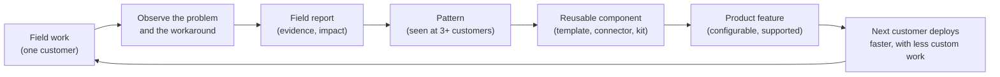

# The field-to-product loop

Source: [Chapter 16](../chapters/16-field-to-product.md). Relevant chapters: 16.

```mermaid
flowchart LR
  F["Field work<br/>(one customer)"] --> O["Observe the problem<br/>and the workaround"]
  O --> R["Field report<br/>(evidence, impact)"]
  R --> P["Pattern<br/>(seen at 3+ customers)"]
  P --> C["Reusable component<br/>(template, connector, kit)"]
  C --> Prod["Product feature<br/>(configurable, supported)"]
  Prod --> Next["Next customer deploys<br/>faster, with less custom work"]
  Next --> F
```
