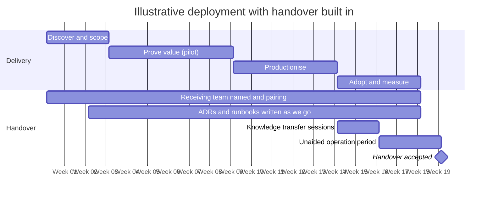

# Handover planned from day one

Relevant chapters: [15](../chapters/15-production-and-handover.md), [20](../chapters/20-case-studies.md).

```mermaid
gantt
  title Illustrative deployment with handover built in
  dateFormat YYYY-MM-DD
  axisFormat Week %W
  section Delivery
  Discover and scope            :a1, 2026-01-05, 3w
  Prove value (pilot)           :a2, after a1, 6w
  Productionise                 :a3, after a2, 5w
  Adopt and measure             :a4, after a3, 4w
  section Handover
  Receiving team named and pairing :b1, 2026-01-05, 18w
  ADRs and runbooks written as we go :b2, 2026-01-19, 16w
  Knowledge transfer sessions   :b3, after a3, 2w
  Unaided operation period      :b4, 2026-04-27, 3w
  Handover accepted             :milestone, 2026-05-18, 0d
```
