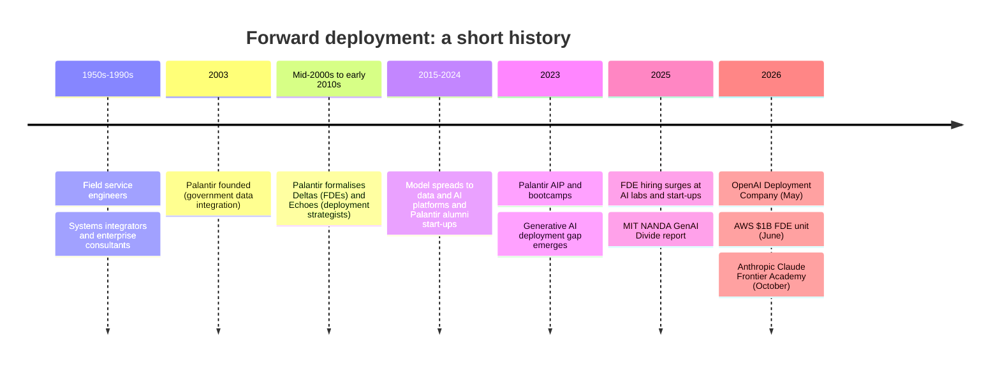

# Forward deployment: a short history

Source: [Chapter 2](../chapters/02-history.md). Relevant chapters: 2.

```mermaid
timeline
  title Forward deployment: a short history
  1950s-1990s : Field service engineers : Systems integrators and enterprise consultants
  2003 : Palantir founded (government data integration)
  Mid-2000s to early 2010s : Palantir formalises Deltas (FDEs) and Echoes (deployment strategists)
  2015-2024 : Model spreads to data and AI platforms and Palantir alumni start-ups
  2023 : Palantir AIP and bootcamps : Generative AI deployment gap emerges
  2025 : FDE hiring surges at AI labs and start-ups : MIT NANDA GenAI Divide report
  2026 : OpenAI Deployment Company (May) : AWS $1B FDE unit (June) : Anthropic Claude Frontier Academy (October)
```
