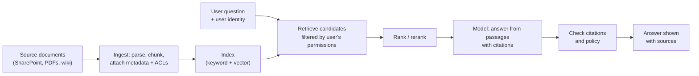

# Permission-aware RAG architecture

Source: [Chapter 12](../chapters/12-ai-deployment.md). Relevant chapters: 12.

```mermaid
flowchart LR
  Docs["Source documents<br/>(SharePoint, PDFs, wiki)"] --> Ingest["Ingest: parse, chunk,<br/>attach metadata + ACLs"]
  Ingest --> Index["Index<br/>(keyword + vector)"]
  U["User question<br/>+ user identity"] --> Ret["Retrieve candidates<br/>filtered by user's permissions"]
  Index --> Ret
  Ret --> Rank["Rank / rerank"]
  Rank --> LLM["Model: answer from passages<br/>with citations"]
  LLM --> Check["Check citations<br/>and policy"]
  Check --> Out["Answer shown<br/>with sources"]
```
