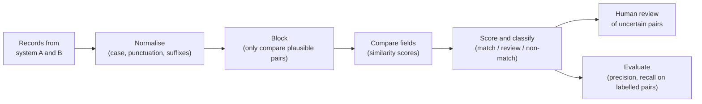

# Entity resolution pipeline

Source: [Chapter 10](../chapters/10-enterprise-data.md). Relevant chapters: 10.

```mermaid
flowchart LR
  A["Records from<br/>system A and B"] --> N["Normalise<br/>(case, punctuation, suffixes)"]
  N --> B["Block<br/>(only compare plausible pairs)"]
  B --> C["Compare fields<br/>(similarity scores)"]
  C --> S["Score and classify<br/>(match / review / non-match)"]
  S --> R["Human review<br/>of uncertain pairs"]
  S --> E["Evaluate<br/>(precision, recall on labelled pairs)"]
```
