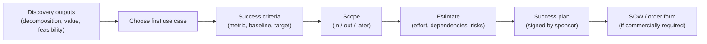

# From discovery to success plan and SOW

Source: [Chapter 6](../chapters/06-scoping.md). Relevant chapters: 6.

```mermaid
flowchart LR
  D["Discovery outputs<br/>(decomposition, value, feasibility)"] --> P["Choose first use case"]
  P --> SC["Success criteria<br/>(metric, baseline, target)"]
  SC --> S["Scope<br/>(in / out / later)"]
  S --> E["Estimate<br/>(effort, dependencies, risks)"]
  E --> SP["Success plan<br/>(signed by sponsor)"]
  SP --> SOW["SOW / order form<br/>(if commercially required)"]
```
