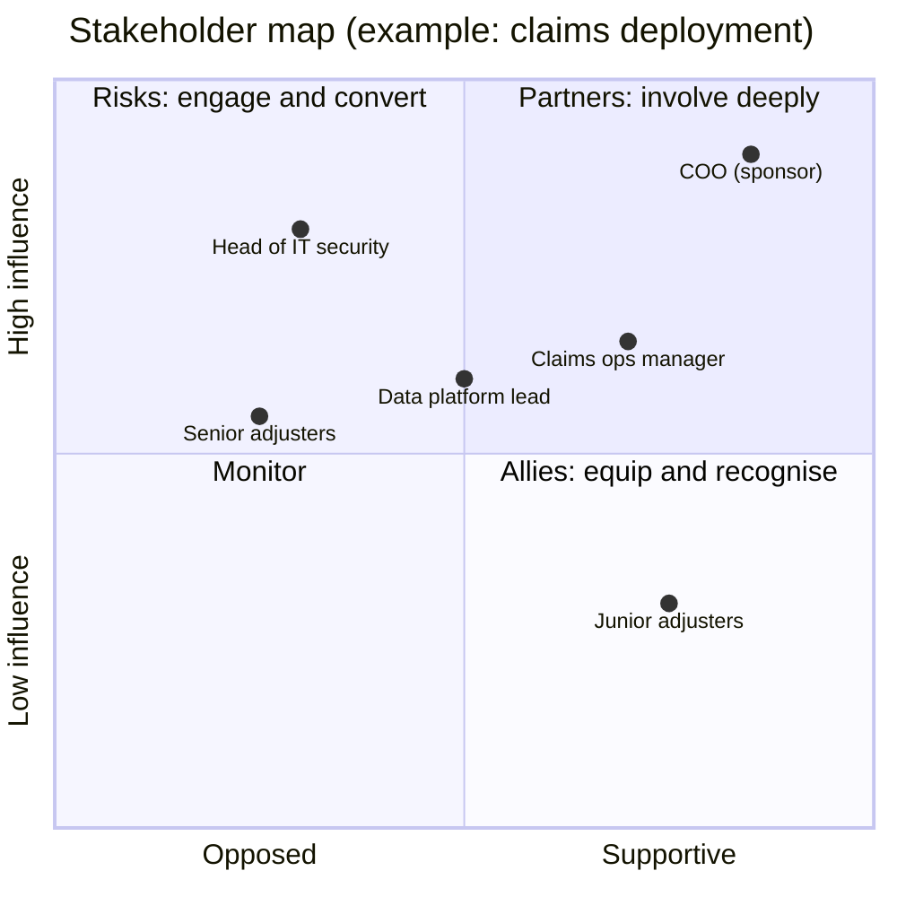

# Stakeholder map: influence × attitude

Source: [Chapter 7](../chapters/07-stakeholders.md). Relevant chapters: 7.

```mermaid
quadrantChart
  title Stakeholder map (example: claims deployment)
  x-axis "Opposed" --> "Supportive"
  y-axis "Low influence" --> "High influence"
  quadrant-1 "Partners: involve deeply"
  quadrant-2 "Risks: engage and convert"
  quadrant-3 "Monitor"
  quadrant-4 "Allies: equip and recognise"
  "COO (sponsor)": [0.85, 0.9]
  "Head of IT security": [0.3, 0.8]
  "Claims ops manager": [0.7, 0.65]
  "Senior adjusters": [0.25, 0.55]
  "Junior adjusters": [0.75, 0.3]
  "Data platform lead": [0.5, 0.6]
```
