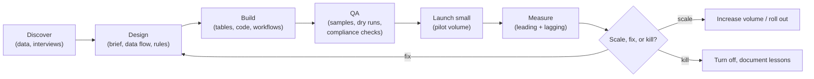

# GTM engineering delivery process

Discover, design, build, QA, launch, measure, decide.

Used in [Chapter 18](../chapters/18-practice.md).

```mermaid
flowchart LR
  D["Discover<br/>(data, interviews)"] --> DS["Design<br/>(brief, data flow, rules)"]
  DS --> B["Build<br/>(tables, code, workflows)"]
  B --> QA["QA<br/>(samples, dry runs,<br/>compliance checks)"]
  QA --> L["Launch small<br/>(pilot volume)"]
  L --> M["Measure<br/>(leading + lagging)"]
  M --> I{"Scale, fix, or kill?"}
  I -- scale --> SC["Increase volume / roll out"]
  I -- fix --> DS
  I -- kill --> K["Turn off, document lessons"]
```
