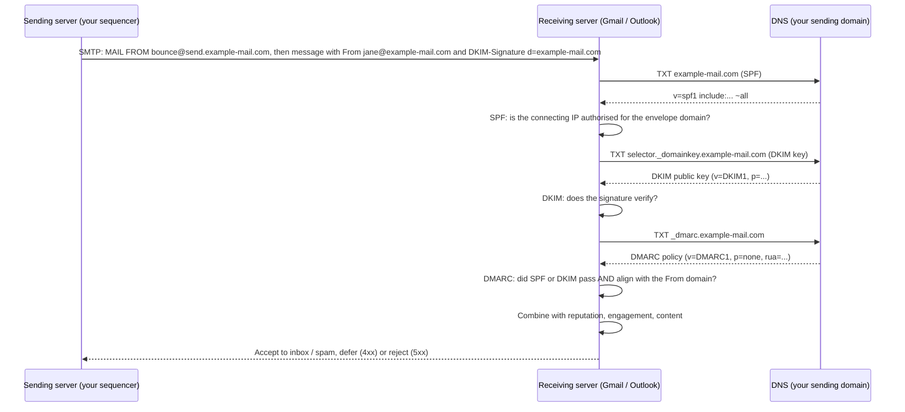

# How SPF, DKIM and DMARC fit together

Used in [Chapter 11](../chapters/11-deliverability.md).

```mermaid
sequenceDiagram
  participant S as Sending server (your sequencer)
  participant R as Receiving server (Gmail / Outlook)
  participant DNS as DNS (your sending domain)
  S->>R: SMTP: MAIL FROM bounce@send.example-mail.com, then message with From jane@example-mail.com and DKIM-Signature d=example-mail.com
  R->>DNS: TXT example-mail.com (SPF)
  DNS-->>R: v=spf1 include:... ~all
  R->>R: SPF: is the connecting IP authorised for the envelope domain?
  R->>DNS: TXT selector._domainkey.example-mail.com (DKIM key)
  DNS-->>R: DKIM public key (v=DKIM1, p=...)
  R->>R: DKIM: does the signature verify?
  R->>DNS: TXT _dmarc.example-mail.com
  DNS-->>R: DMARC policy (v=DMARC1, p=none, rua=...)
  R->>R: DMARC: did SPF or DKIM pass AND align with the From domain?
  R->>R: Combine with reputation, engagement, content
  R-->>S: Accept to inbox / spam, defer (4xx) or reject (5xx)
```
