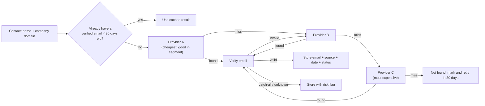

# Email enrichment waterfall

Cache, providers in order, verification after each, provenance.

Used in [Chapter 7](../chapters/07-enrichment.md).

```mermaid
flowchart LR
  IN["Contact: name + company domain"] --> C{"Already have a<br/>verified email < 90 days old?"}
  C -- yes --> OUT["Use cached result"]
  C -- no --> P1["Provider A<br/>(cheapest, good in segment)"]
  P1 -- found --> V["Verify email"]
  P1 -- miss --> P2["Provider B"]
  P2 -- found --> V
  P2 -- miss --> P3["Provider C<br/>(most expensive)"]
  P3 -- found --> V
  P3 -- miss --> NF["Not found: mark and retry in 30 days"]
  V -- valid --> OUT2["Store email + source + date + status"]
  V -- "catch-all / unknown" --> RISK["Store with risk flag"]
  V -- invalid --> P2
```
