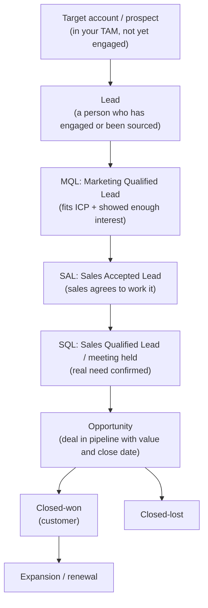

# The B2B funnel

From target account to closed-won and expansion.

Used in [Chapter 3](../chapters/03-how-b2b-sells.md).

```mermaid
flowchart TB
  A["Target account / prospect<br/>(in your TAM, not yet engaged)"] --> B["Lead<br/>(a person who has engaged or been sourced)"]
  B --> C["MQL: Marketing Qualified Lead<br/>(fits ICP + showed enough interest)"]
  C --> D["SAL: Sales Accepted Lead<br/>(sales agrees to work it)"]
  D --> E["SQL: Sales Qualified Lead / meeting held<br/>(real need confirmed)"]
  E --> F["Opportunity<br/>(deal in pipeline with value and close date)"]
  F --> G["Closed-won<br/>(customer)"]
  F --> H["Closed-lost"]
  G --> I["Expansion / renewal"]
```
