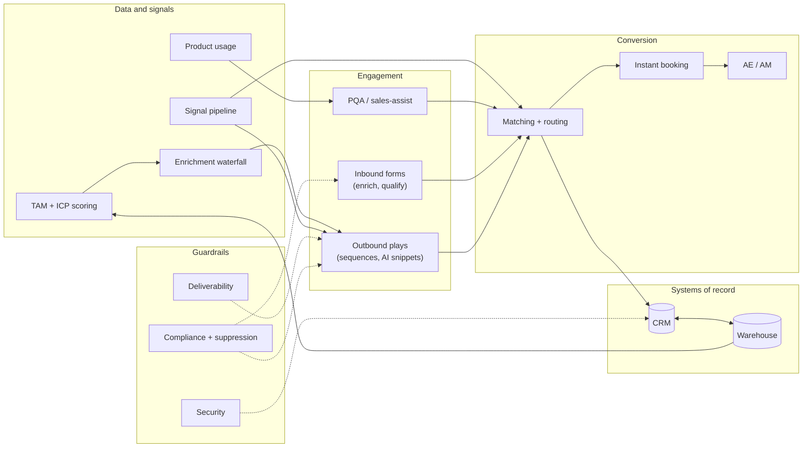

# GTM system map

How the systems a GTM engineer builds fit together.

Used in [Chapter 1](../chapters/01-the-role.md) and [Chapter 17](../chapters/17-stack.md).

```mermaid
flowchart LR
  subgraph Data["Data and signals"]
    TAM["TAM + ICP scoring"]
    ENR["Enrichment waterfall"]
    SIG["Signal pipeline"]
    PROD["Product usage"]
  end
  subgraph Engage["Engagement"]
    OUT["Outbound plays<br/>(sequences, AI snippets)"]
    IN["Inbound forms<br/>(enrich, qualify)"]
    PLG["PQA / sales-assist"]
  end
  subgraph Convert["Conversion"]
    ROUTE["Matching + routing"]
    BOOK["Instant booking"]
    AE["AE / AM"]
  end
  subgraph Core["Systems of record"]
    CRM[("CRM")]
    WH[("Warehouse")]
  end
  subgraph Guard["Guardrails"]
    DEL["Deliverability"]
    COMP["Compliance + suppression"]
    SEC["Security"]
  end
  TAM --> ENR --> OUT
  SIG --> OUT
  SIG --> ROUTE
  PROD --> PLG --> ROUTE
  IN --> ROUTE --> BOOK --> AE
  OUT --> ROUTE
  ROUTE --> CRM
  CRM <--> WH
  WH --> TAM
  DEL -.-> OUT
  COMP -.-> OUT
  COMP -.-> IN
  SEC -.-> CRM
```
