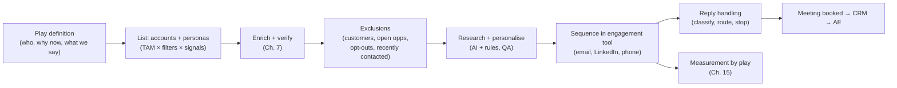

# Anatomy of an outbound system

From play definition to meetings and measurement.

Used in [Chapter 10](../chapters/10-outbound.md).

```mermaid
flowchart LR
  P["Play definition<br/>(who, why now, what we say)"] --> L["List: accounts + personas<br/>(TAM × filters × signals)"]
  L --> E["Enrich + verify<br/>(Ch. 7)"]
  E --> X["Exclusions<br/>(customers, open opps,<br/>opt-outs, recently contacted)"]
  X --> R["Research + personalise<br/>(AI + rules, QA)"]
  R --> S["Sequence in engagement tool<br/>(email, LinkedIn, phone)"]
  S --> RH["Reply handling<br/>(classify, route, stop)"]
  RH --> M["Meeting booked → CRM → AE"]
  S --> MEAS["Measurement by play<br/>(Ch. 15)"]
```
