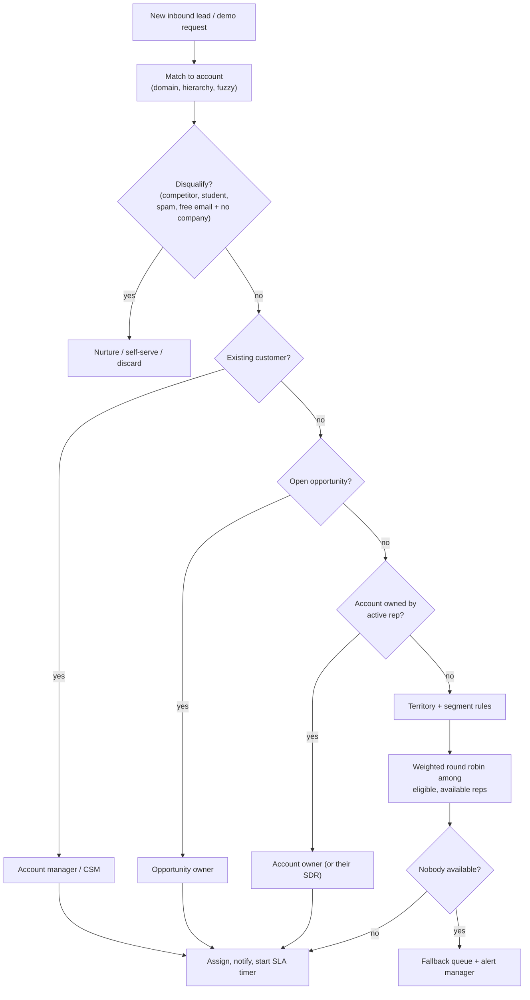

# Inbound routing logic

Rules of engagement as a decision flow.

Used in [Chapter 9](../chapters/09-scoring-and-routing.md).

```mermaid
flowchart TB
  IN["New inbound lead / demo request"] --> M["Match to account<br/>(domain, hierarchy, fuzzy)"]
  M --> Q{"Disqualify?<br/>(competitor, student,<br/>spam, free email + no company)"}
  Q -- yes --> NUR["Nurture / self-serve / discard"]
  Q -- no --> C{"Existing customer?"}
  C -- yes --> AM["Account manager / CSM"]
  C -- no --> O{"Open opportunity?"}
  O -- yes --> OO["Opportunity owner"]
  O -- no --> OW{"Account owned by<br/>active rep?"}
  OW -- yes --> AO["Account owner (or their SDR)"]
  OW -- no --> T["Territory + segment rules"]
  T --> RR["Weighted round robin among<br/>eligible, available reps"]
  RR --> FB{"Nobody available?"}
  FB -- yes --> QUEUE["Fallback queue + alert manager"]
  FB -- no --> ASSIGN["Assign, notify, start SLA timer"]
  AO --> ASSIGN
  OO --> ASSIGN
  AM --> ASSIGN
```
