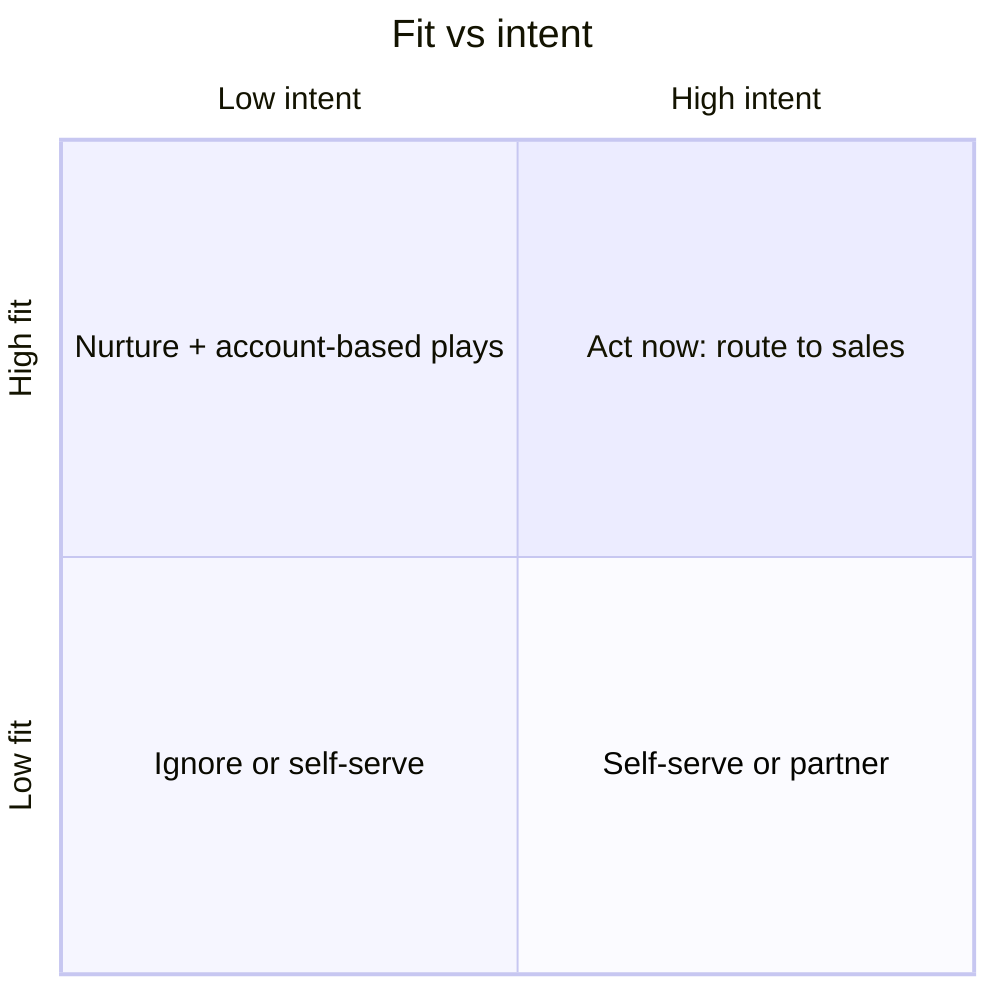

# Fit × intent prioritisation

Used in [Chapter 9](../chapters/09-scoring-and-routing.md).

```mermaid
quadrantChart
  title Fit vs intent
  x-axis Low intent --> High intent
  y-axis Low fit --> High fit
  quadrant-1 "Act now: route to sales"
  quadrant-2 "Nurture + account-based plays"
  quadrant-3 "Ignore or self-serve"
  quadrant-4 "Self-serve or partner"
```
