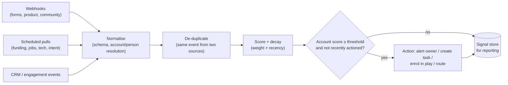

# Signal-to-action pipeline

Normalise, de-duplicate, score with decay, act at thresholds.

Used in [Chapter 8](../chapters/08-signals.md).

```mermaid
flowchart LR
  S1["Webhooks<br/>(forms, product, community)"] --> N["Normalise<br/>(schema, account/person resolution)"]
  S2["Scheduled pulls<br/>(funding, jobs, tech, intent)"] --> N
  S3["CRM / engagement events"] --> N
  N --> D["De-duplicate<br/>(same event from two sources)"]
  D --> SC["Score + decay<br/>(weight × recency)"]
  SC --> T{"Account score ≥ threshold<br/>and not recently actioned?"}
  T -- yes --> A["Action: alert owner / create task /<br/>enrol in play / route"]
  T -- no --> STORE[("Signal store<br/>for reporting")]
  A --> STORE
```
