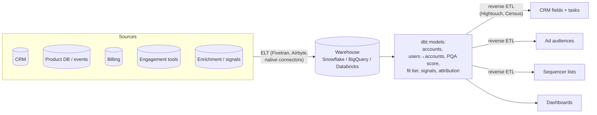

# Warehouse-native GTM

Sources to warehouse, dbt models, reverse ETL to tools.

Used in [Chapter 12](../chapters/12-inbound-and-plg.md).

```mermaid
flowchart LR
  subgraph Sources
    CRM[("CRM")]
    PROD[("Product DB / events")]
    BILL[("Billing")]
    ENG[("Engagement tools")]
    ENR[("Enrichment / signals")]
  end
  Sources -- "ELT (Fivetran, Airbyte,<br/>native connectors)" --> WH[("Warehouse<br/>Snowflake / BigQuery / Databricks")]
  WH --> DBT["dbt models:<br/>accounts, users→accounts, PQA score,<br/>fit tier, signals, attribution"]
  DBT -- "reverse ETL<br/>(Hightouch, Census)" --> CRM2["CRM fields + tasks"]
  DBT -- "reverse ETL" --> ADS["Ad audiences"]
  DBT -- "reverse ETL" --> SEQ["Sequencer lists"]
  DBT --> BI["Dashboards"]
```
