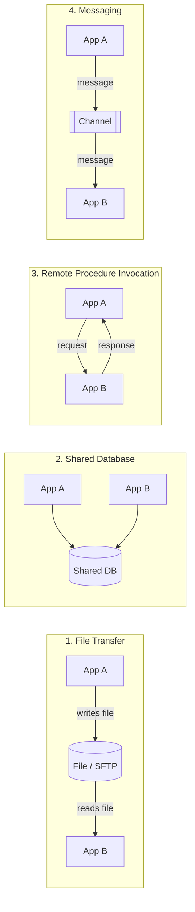
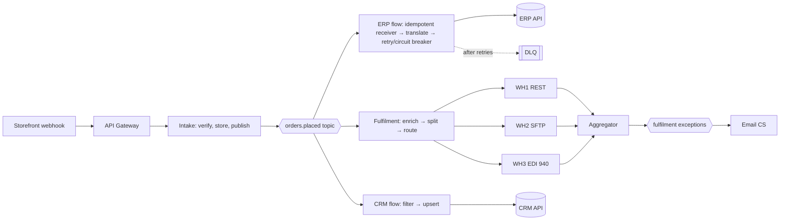

# Chapter 5. Integration Styles and Enterprise Integration Patterns

> "A pattern is a solution to a problem in a context."
> (Christopher Alexander, paraphrased)

## What you will learn

- The four fundamental integration styles, and how to choose between them.
- Coupling: the dimensions along which integrated systems depend on each other.
- Synchronous versus asynchronous, orchestration versus choreography, push versus pull.
- The core **Enterprise Integration Patterns** (EIP) vocabulary: channels, messages, routing, transformation, endpoints and system management.
- How to compose patterns into real integration designs.

---

## 5.1 The four integration styles

Hohpe and Woolf identify four basic ways for applications to share data and functionality. Every integration you build is one of these, or a combination of them.

### Style 1: File transfer

One application writes a file; another reads it later.

- **Strengths:** simple; durable; easy to inspect, archive and replay; universal (every system can produce a CSV); tolerant of long outages; well suited to large volumes.
- **Weaknesses:** latency (batch intervals); partial-file and duplicate-file problems; coordination by naming convention; weak error feedback to the sender.
- **Use when:** bulk data, daily cycles, partners with limited technology, regulatory reporting, mainframes.
- **Design essentials:**
  - **Atomic handoff:** write to a temporary name (`orders_20261009.csv.tmp`) and rename when complete, or write a separate **trigger/manifest file** (`.done`, `.ok`) after the data file. Never let a reader pick up a half-written file.
  - **Naming convention** with a timestamp and sequence number, and no reprocessing of the same name.
  - **Control totals:** record count and amount totals in a trailer or manifest, so the reader can verify completeness.
  - **Archiving:** move processed files to `archive/` and failed ones to `error/`.
  - **Idempotent processing:** keep a record of processed file names and checksums.

### Style 2: Shared database

Several applications read and write the same database, or one application reads another's database directly.

- **Strengths:** immediate consistency, no transformation, uses familiar SQL.
- **Weaknesses:** tightest coupling possible. Schema changes break other applications; there is no encapsulation of business rules; it causes performance contention; vendors rarely support it (reading a SaaS vendor's database is usually impossible or a contract breach).
- **Use when:** rarely, as a deliberate choice. Acceptable variants: **read-only replicas or views** designed for integration; **CDC** from the database log (Chapter 9), which turns the database into an event source without query coupling; and reporting databases.
- **Antipattern:** an integration that writes directly into another application's tables, bypassing its business logic. Expect corrupted data and voided support contracts.

### Style 3: Remote Procedure Invocation (request/response APIs)

One application calls another's API and waits for a response. In practice this means REST, GraphQL, gRPC or SOAP (Chapter 6).

- **Strengths:** immediate answers; encapsulation (the provider controls its logic and data); a clear contract; familiar to developers.
- **Weaknesses:** **temporal coupling** (both systems must be up at the same time); latency adds up along call chains; failures cascade; caller and callee must be scaled together.
- **Use when:** the caller *needs an answer now* (price check, credit check, validating an address, reading current state for a user interface) or the operation is a command that must be confirmed synchronously.

### Style 4: Messaging

Applications exchange messages through a **channel** managed by messaging middleware: a queue, a topic or a log (Chapter 7).

- **Strengths:** temporal decoupling (the receiver can be down); load levelling (queues absorb spikes); fan-out to many consumers; retries and dead-lettering built in; the most resilient style.
- **Weaknesses:** eventual consistency; harder to reason about and debug; ordering and duplicate delivery need care; more infrastructure.
- **Use when:** the sender does not need an immediate answer, volumes are spiky, several systems need the same information, or reliability matters more than latency.

### Choosing a style

| Question | Leans toward |
|---|---|
| Does the caller need the result to continue? | API (sync) |
| Must it work while the target is down? | Messaging or file |
| Many consumers of the same fact? | Messaging (pub/sub) |
| Very large volumes, periodic? | File, or bulk API |
| Partner can only do SFTP? | File |
| Real-time analytics or replication of a whole database? | CDC / streaming |
| Human-facing UI needs current data? | API (possibly backed by a cache populated by events) |

Real designs combine styles. A common one: **an API to accept a command, then messaging to process it.** For example, the storefront calls `POST /orders`; the order service validates the order, stores it, returns `202 Accepted`, and publishes `OrderPlaced` for fulfilment, ERP and analytics to consume asynchronously.

---

## 5.2 Coupling: what you are really designing

Integration is the art of managing **coupling**, the degree to which a change or failure in one system affects another. Coupling has several dimensions:

| Dimension | Tight | Loose |
|---|---|---|
| **Temporal** | Both must be available at the same time (sync API) | Store-and-forward (queue, file) |
| **Location** | Hard-coded hostnames | Discovery, gateways, topics |
| **Format / schema** | Exact schema match required | Tolerant reader, versioned schemas |
| **Semantic** | Consumer must understand the provider's internal model | Shared, documented business concepts |
| **Platform / technology** | Same language or framework required (Java RMI) | Language-neutral (HTTP, JSON, AMQP) |
| **Interaction style** | Consumer knows which provider and how to orchestrate it | Consumer reacts to events without knowing the producer |
| **Conversation** | Multi-step stateful protocol | Self-contained messages |
| **Ownership / release** | Coordinated deployments | Independent deployments |

You cannot eliminate coupling; two systems that exchange data are coupled by definition. The goal is **deliberate** coupling: accept tight coupling where it buys something (a synchronous credit check gives an immediate decision) and loosen it elsewhere.

---

## 5.3 Interaction dimensions

### Synchronous versus asynchronous

- **Synchronous:** the caller blocks until the response arrives (HTTP request/response).
- **Asynchronous:** the caller continues and learns of the outcome later, through a callback, a polled status, a reply message or an event.

Asynchronous request/response is a common hybrid: send a request message with a **Correlation Identifier** and a **Return Address** (reply queue or callback URL), and match the reply when it arrives.

### Push versus pull

- **Push:** the source sends data when it changes (webhooks, publishing to a topic, SFTP put).
- **Pull:** the target asks periodically (polling an API, a consumer reading a queue, SFTP get).

Push is lower latency and more efficient. Pull is simpler to secure (no inbound connection) and lets the consumer control its pace. Many SaaS integrations combine them: a **webhook as a doorbell**, followed by a pull of the current state (Chapter 7 calls this "thin events").

### Orchestration versus choreography

When a business process spans several systems:

- **Orchestration:** a central coordinator (an iPaaS flow, a workflow engine such as Temporal, Camunda or AWS Step Functions, or a process API) tells each system what to do, in order, and handles failures.
- **Choreography:** each system reacts to events from the others; no one is in charge.

| | Orchestration | Choreography |
|---|---|---|
| Visibility of the process | High: it is in one place | Low: spread across services |
| Coupling | Coordinator knows everyone | Services only know events |
| Change | Edit the orchestrator | Change several services |
| Failure handling | Centralised compensation | Each service must handle its own |
| Risk | Central bottleneck, "god service" | Hidden process, cyclic dependencies |

A common heuristic: **orchestrate within a bounded context or a single business process with clear ownership; choreograph across domains**, with events as the public contract between them.

### Stateless versus stateful integration

A stateless flow transforms and forwards each message independently. Stateful flows (aggregations, sagas, long-running processes, sync jobs with cursors) must persist state somewhere durable, survive restarts and handle concurrency. Know which kind you are building, because stateful flows need much more design for recovery.

---

## 5.4 The Enterprise Integration Patterns vocabulary

*Enterprise Integration Patterns* (Hohpe and Woolf, 2003) catalogues 65 patterns with a visual notation. Below are the ones you will use constantly, grouped as in the book. The vocabulary appears in Apache Camel, Spring Integration, MuleSoft, Azure Logic Apps, Boomi and many design reviews. Speaking it fluently is part of the job.

### Messaging systems (the building blocks)

| Pattern | What it is |
|---|---|
| **Message Channel** | A logical pipe connecting sender and receiver (queue, topic). |
| **Message** | A data record with a header (metadata) and a body (payload). |
| **Pipes and Filters** | Decompose processing into independent steps connected by channels. Each iPaaS flow is a pipeline. |
| **Message Router** | Decides which channel a message goes to. |
| **Message Translator** | Converts a message from one format to another (Chapter 4). |
| **Message Endpoint** | The code that connects an application to a channel. |

### Messaging channels

| Pattern | What it is |
|---|---|
| **Point-to-Point Channel** | Each message is consumed by exactly one receiver (a queue). Good for commands and work distribution. |
| **Publish-Subscribe Channel** | Each message goes to every subscriber (a topic). Good for events. |
| **Datatype Channel** | One channel per message type, so receivers know what they get. |
| **Invalid Message Channel** | Where messages that cannot be parsed or validated go. |
| **Dead Letter Channel** (DLQ) | Where messages that cannot be *delivered or processed* go after retries. Chapter 8. |
| **Guaranteed Delivery** | Messages persisted so they survive crashes. |
| **Channel Adapter** | Connects an application that does not speak messaging to a channel, as iPaaS connectors do. |
| **Messaging Bridge** | Connects two messaging systems. |
| **Message Bus** | A shared infrastructure of channels plus a canonical model, the conceptual ancestor of the ESB. |

### Message construction

| Pattern | What it is |
|---|---|
| **Command Message** | Asks the receiver to do something (`ShipOrder`). |
| **Document Message** | Carries data (`CustomerRecord`). |
| **Event Message** | Announces that something happened (`OrderShipped`). |
| **Request-Reply** | A request message with a reply on another channel. |
| **Return Address** | The request says where to send the reply. |
| **Correlation Identifier** | Ties a reply (or any related message) to its request. |
| **Message Sequence** | A large payload split into numbered parts. |
| **Message Expiration** | A time-to-live after which the message is discarded. |
| **Format Indicator** | A version or format field in the message. |

**Commands versus events** is an essential distinction. A command (`ChargeCard`) is addressed to one handler, may be rejected, and expresses intent. An event (`CardCharged`) is a fact about the past, cannot be rejected, and may have any number of subscribers. Name them accordingly: commands are imperative, events are past tense.

### Message routing

| Pattern | What it is | Example |
|---|---|---|
| **Content-Based Router** | Routes by message content. | Orders over $10,000 go to manual review. |
| **Message Filter** | Drops messages that do not match. | Ignore test-store orders. |
| **Dynamic Router** | Routing rules changed at runtime via control messages or configuration. | Per-tenant destinations. |
| **Recipient List** | Sends to a computed list of recipients. | Notify the warehouses that stock the SKU. |
| **Splitter** | Breaks one message into many. | One order produces one message per line item. |
| **Aggregator** | Combines related messages into one. Needs a *correlation* rule, a *completeness* condition (count, timeout or marker) and an *aggregation* strategy. | Collect all line-item fulfilments, then send one shipment confirmation. |
| **Resequencer** | Restores order to out-of-order messages. | |
| **Composed Message Processor** | Split, route each part, then aggregate. | Price each line at a different supplier, then total. |
| **Scatter-Gather** | Broadcast a request to many and aggregate the replies. | Get quotes from three shipping carriers; choose the cheapest. |
| **Routing Slip** | The message carries its own itinerary of steps. | |
| **Process Manager** | A central component that maintains process state and decides the next step: orchestration. The ancestor of sagas and workflow engines. | |
| **Message Broker** | A central hub that decouples routing from senders and receivers. | |

### Message transformation

| Pattern | What it is |
|---|---|
| **Envelope Wrapper** | Wrap a payload in a protocol envelope (SOAP envelope, CloudEvents attributes). |
| **Content Enricher** | Add data from another source. Example: an order carries only `customer_id`; look up the customer's tax status. |
| **Content Filter** | Remove unneeded data, which is also a privacy control (data minimisation). |
| **Claim Check** | Store a large payload in storage, send only a reference, retrieve it later. Essential when brokers cap message size (Amazon SQS at 1 MiB since August 2025, previously 256 KiB; Kafka at about 1 MB by default; Azure Service Bus Standard at 256 KB). |
| **Normalizer** | Convert various formats into one common format. |
| **Canonical Data Model** | Chapter 4. |

### Messaging endpoints

| Pattern | What it is |
|---|---|
| **Messaging Gateway** | Wraps messaging behind a domain interface, hiding it from business code. |
| **Messaging Mapper** | Maps domain objects to and from messages. |
| **Transactional Client** | Makes receiving, processing and sending atomic with the database work. The basis of the **Transactional Outbox** (Chapter 8). |
| **Polling Consumer** | The consumer pulls messages when ready. |
| **Event-Driven Consumer** | Messages are pushed to the consumer as they arrive. |
| **Competing Consumers** | Several consumers on one queue for parallelism. |
| **Message Dispatcher** | One consumer dispatches to several performers. |
| **Selective Consumer** | Consumes only matching messages. |
| **Durable Subscriber** | A subscription that keeps messages while the subscriber is offline. |
| **Idempotent Receiver** | Safely handles duplicate messages. **The single most important endpoint pattern.** Chapter 8. |
| **Service Activator** | Connects a service to messaging so it can be invoked by messages. |

### System management

| Pattern | What it is |
|---|---|
| **Control Bus** | A channel for managing the integration system itself (pause, resume, change configuration). |
| **Detour** | Route messages through extra steps (validation, logging) when switched on. |
| **Wire Tap** | Copy messages to a secondary channel for inspection or auditing without disturbing the flow. |
| **Message History** | The message records which components it passed through. Today this is usually handled by distributed tracing. |
| **Message Store** | Persist messages for auditing and replay. |
| **Smart Proxy** | Track request-reply through an intermediary. |
| **Test Message** | Inject synthetic messages to check health (synthetic monitoring). |
| **Channel Purger** | Clear a channel, for example in test environments. |

---

## 5.5 Patterns beyond the 2003 catalogue

Integration practice since 2003 has added patterns you will also use. Each is treated in depth in later chapters:

| Pattern | Problem it solves | Chapter |
|---|---|---|
| **Transactional Outbox** | Update a database and publish an event atomically. | 8 |
| **Inbox / de-duplication table** | Process each message exactly once in effect. | 8 |
| **Saga** (orchestrated or choreographed) | Long-running, multi-system transactions without distributed locks, using compensating actions. | 8 |
| **Circuit Breaker, Bulkhead, Retry with backoff and jitter** | Contain failures. | 8 |
| **Change Data Capture** | Turn database changes into events. | 9 |
| **Event Sourcing** | Store state as an append-only sequence of events. | 7 |
| **CQRS** (Command Query Responsibility Segregation) | Separate write models from read models, often fed by events. | 7 |
| **Event-Carried State Transfer** | Events carry enough data that consumers need not call back. | 7 |
| **Webhook** | HTTP push notification from SaaS systems. | 7 |
| **Backend for Frontend / Experience API** | Shape APIs per consumer. | 6, 17 |
| **API Gateway** | Single entry point for authentication, rate limiting and routing. | 11 |
| **Strangler Fig** | Incrementally replace a legacy system behind a façade. | 17 |
| **Anti-Corruption Layer** | Protect your domain model from another system's model by translating at the boundary. | 17 |
| **Sidecar / service mesh** | Move cross-cutting networking concerns out of application code. | 11 |
| **Reconciliation** | Periodically compare systems and repair drift. | 8, 9 |

---

## 5.6 Composing patterns: a worked example

**Requirement:** when an e-commerce order is placed, (1) reserve stock in the ERP, (2) send a pick instruction to whichever of three warehouses stocks the items, (3) notify the CRM, and (4) if any line cannot be fulfilled, email customer service. Expected peak: 50 orders per second during sales. The ERP is down every Sunday 02:00–04:00 for maintenance.

**Design in pattern language:**

1. The storefront emits an **Event Message** `OrderPlaced` via a **webhook** to an **API Gateway**, which forwards it to an intake endpoint.
2. The intake endpoint verifies the webhook signature, stores the raw payload in a **Message Store**, and puts the event on a durable **Publish-Subscribe Channel** (`orders.placed`), then returns `200` immediately. *Why:* to acknowledge fast, decouple from downstream outages, and absorb peaks.
3. Subscriber A (ERP flow) is a set of **Competing Consumers** with an **Idempotent Receiver** (de-duplicating on order ID). A **Message Translator** maps the event to an ERP sales order, then calls the ERP API with **retry with backoff** and a **Circuit Breaker**. During the Sunday window the circuit opens and messages wait in the queue. After the final retry, messages go to a **Dead Letter Channel**.
4. Subscriber B (fulfilment flow) uses a **Content Enricher** to look up stock locations, then a **Splitter** by warehouse and a **Content-Based Router** to each warehouse's **Channel Adapter** (one REST, one SFTP file, one EDI 940). An **Aggregator** collects the per-warehouse acknowledgements; if a line is rejected or the aggregation **times out**, it emits `OrderFulfilmentException`.
5. Subscriber C (CRM flow) applies a **Content Filter** (only the fields the CRM needs, which minimises personal data) and upserts by external ID.
6. A small flow consumes `OrderFulfilmentException` and emails customer service.
7. A **Wire Tap** and **distributed tracing** (one trace ID from intake through every subscriber) provide observability. A **Control Bus** lets operators pause a subscriber and replay from the store.

Notice how naming the patterns makes the design reviewable. A reviewer can ask "what is the aggregator's completeness condition?" or "what does the idempotent receiver key on?", and those are exactly the questions that prevent incidents.

---

## 5.7 Antipatterns

| Antipattern | Symptom | Remedy |
|---|---|---|
| **Point-to-point spaghetti** | Every system wired to every other; nobody knows what depends on what | Hub, events or an API layer; plus an integration catalogue |
| **Integration database** | Several apps writing each other's tables | APIs or events; CDC for reads |
| **Distributed monolith** | Microservices that must all deploy together; long synchronous call chains | Asynchronous events; consumer-driven contracts |
| **Chatty integration** | Hundreds of fine-grained calls per business transaction | Coarse-grained or bulk APIs; batching |
| **Smart pipes** | Business rules buried in ESB or iPaaS flows that no domain team owns | Keep rules in domain services; keep pipes simple |
| **Synchronous chains of five or more services** | Availability multiplies down (five services at 99.9% each give about 99.5%); latency adds up | Async messaging; caching; fewer hops |
| **Swallowed errors** | Failures logged and forgotten; data silently missing | DLQs, alerts, reconciliation |
| **Fire and forget without a durable channel** | Lost messages during outages | Guaranteed delivery |
| **Polling too aggressively** | Rate limits hit; costs explode | Webhooks, conditional requests, incremental cursors |
| **"Temporary" manual CSV uploads** | Run for years, by one person | Automate, or at least document and monitor |

---

## Summary

- Four styles (file, shared database, RPC, messaging) underlie every integration. Choose by latency, availability, volume and coupling needs, and combine them.
- Coupling has many dimensions. Design it deliberately.
- Learn the EIP vocabulary. It makes designs precise and reviewable.
- Modern additions (outbox, saga, CDC, circuit breaker, webhooks) extend, rather than replace, the classic patterns.

## Exercises

See [`exercises/05-integration-styles-and-patterns.md`](../exercises/05-integration-styles-and-patterns.md).

## Further reading

- Gregor Hohpe and Bobby Woolf, *Enterprise Integration Patterns* (2003), and enterpriseintegrationpatterns.com.
- Gregor Hohpe, *The Software Architect Elevator* (O'Reilly, 2020), on coupling and architecture as decision-making.
- Claus Ibsen and Jonathan Anstey, *Camel in Action*, 2nd edition (Manning, 2018), which shows EIP implemented in code.
- Sam Newman, *Building Microservices*, 2nd edition (O'Reilly, 2021), Chapters 4–6.
