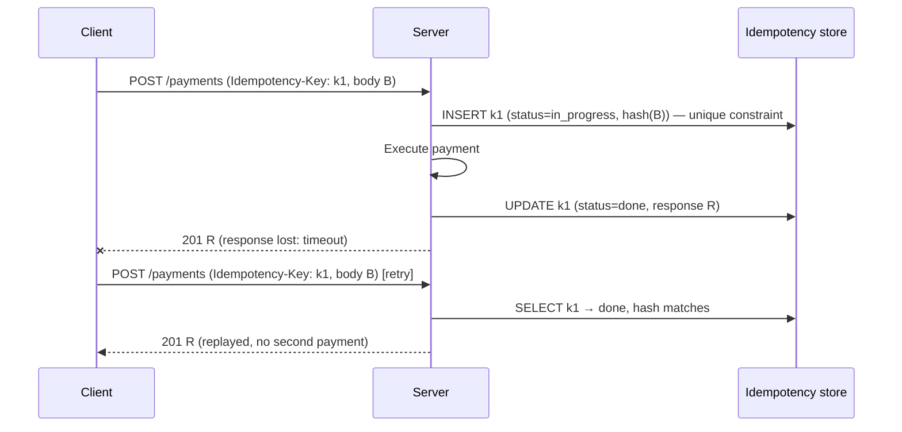
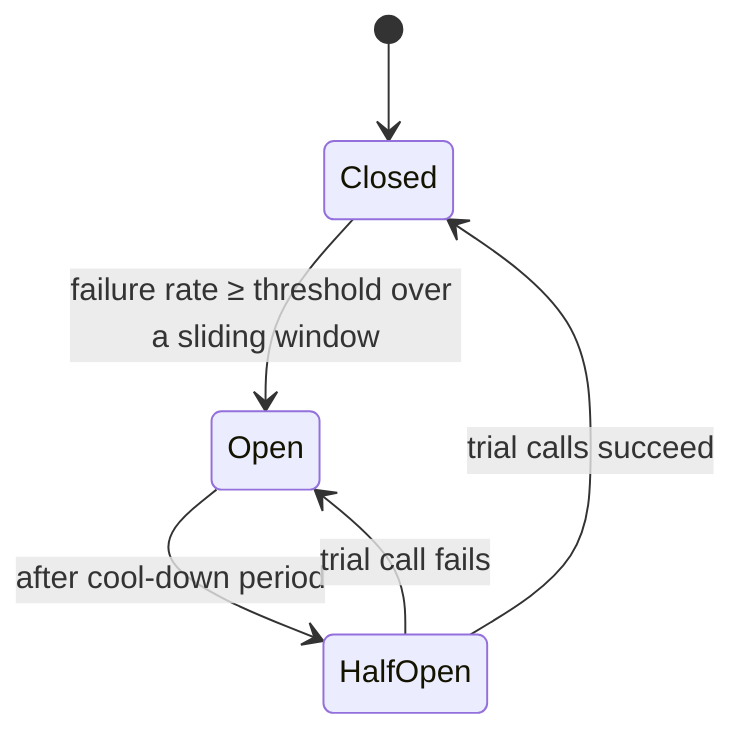
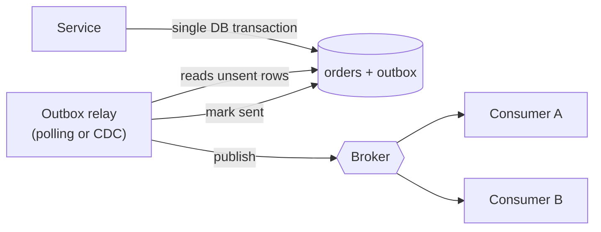

# Chapter 8. Reliability: Designing for Failure

> "Everything fails, all the time."
> (Werner Vogels, CTO, Amazon)

## What you will learn

- A taxonomy of integration failures, and how to classify each error as transient, permanent or ambiguous.
- Timeouts, retries, exponential backoff and jitter, retry budgets and deadline propagation.
- Idempotency: idempotency keys, de-duplication (inbox) tables and natural idempotency.
- Circuit breakers, bulkheads, rate limiters and load shedding.
- Dead-letter queues, poison messages, parking lots and replay.
- The transactional outbox, and why the "dual write" is the most common integration bug.
- Sagas and compensating actions for multi-system business transactions.
- Reconciliation: the safety net under every other technique.

This is the most important chapter in the book. Most integration incidents are not caused by wrong mappings or bad APIs. They are caused by failures the design did not anticipate.

---

## 8.1 Failure is the normal case

An integration that calls three external systems, each 99.9% available, is at best 99.7% available if it needs all three synchronously, which means roughly 26 hours of failure per year. Add network blips, deployments, rate limits, certificate expiries and bad data, and you will see failures *every day*. The design question is never "how do we prevent failure?" but "**what happens to the data and the business process when each step fails?**"

### A taxonomy of failures

| Category | Examples | Typical handling |
|---|---|---|
| **Transient infrastructure** | Connection reset, DNS blip, `502`/`503`/`504`, broker failover | Retry with backoff |
| **Throttling** | `429`, `RESOURCE_EXHAUSTED`, SOAP "concurrent request limit" | Back off, honour `Retry-After`, reduce concurrency |
| **Timeouts (ambiguous outcome)** | Read timeout on a `POST` | Retry **only if idempotent**, or query the outcome first |
| **Authentication** | `401` from an expired token | Refresh the token once, then retry; alert on repeated failure |
| **Authorisation / configuration** | `403`, wrong endpoint, missing scope, IP not allow-listed | Do not retry; alert a human |
| **Data / validation** | `400`/`422`, schema violation, unknown code value, missing reference data | Do not retry unchanged; route to an error queue for correction |
| **Business rule** | "Credit limit exceeded", "Period closed", "Item discontinued" | Business workflow: notify the owner; do not loop |
| **Conflict / concurrency** | `409`, `412`, duplicate key | Re-read and re-apply, or treat as already done |
| **Dependency order** | Order arrives before its customer exists | Retry later (delayed), or create the dependency |
| **Poison message** | Payload crashes the consumer every time | Dead-letter after N attempts |
| **Systemic outage** | Partner down for hours | Queue, open the circuit, pause consumers, catch up later |
| **Silent failure** | Webhook never sent; filter bug drops records | Reconciliation and monitoring |

**Classify every error your integration can receive** into *retryable*, *non-retryable*, or *retryable after a fix*. Encode the classification in code and document it in the design.

---

## 8.2 Timeouts

Chapter 3 introduced connect, read and total timeouts. The reliability rules:

1. **Every remote call has a timeout.** No exceptions.
2. **Timeouts are derived from the latency profile** of the dependency (for example, p99.9 latency plus a margin), not picked arbitrarily.
3. **Timeouts nest:** a caller's timeout must exceed the sum of its callees' timeouts *including retries*, or the caller gives up while the callee is still working, wasting the work and possibly creating duplicates.
4. **Deadlines propagate:** pass the remaining time budget downstream (gRPC does this automatically; with HTTP use a header or compute locally) so that work is abandoned once nobody is waiting for it.

---

## 8.3 Retries done right

Retrying is the first tool everyone reaches for, and the one that most often turns a small problem into an outage.

### When to retry

Retry only when **both** are true:

1. The failure is **transient** (Section 8.1), and
2. The operation is **safe to repeat**: naturally idempotent (`GET`, `PUT`, `DELETE`), or protected by an idempotency key.

### Exponential backoff with jitter

Retrying immediately hammers a struggling service. Retrying on a fixed schedule makes all clients retry *in sync*, causing **thundering herds**. Use exponential backoff with **jitter** (randomness). AWS's analysis (Marc Brooker, "Exponential Backoff and Jitter", 2015) shows "full jitter" performs well:

```
sleep = random_between(0, min(cap, base * 2 ** attempt))
```

```python
import random, time

RETRYABLE_STATUS = {408, 429, 500, 502, 503, 504}

def call_with_retries(send, max_attempts=5, base=0.5, cap=30.0, deadline=None):
    """send() returns (status, headers, body) or raises ConnectionError/TimeoutError."""
    for attempt in range(max_attempts):
        try:
            status, headers, body = send()
        except (ConnectionError, TimeoutError):
            status, headers, body = None, {}, None
        if status is not None and status not in RETRYABLE_STATUS:
            return status, headers, body              # success or non-retryable error
        if attempt == max_attempts - 1:
            break
        delay = random.uniform(0, min(cap, base * 2 ** attempt))
        retry_after = headers.get("Retry-After")
        if retry_after and retry_after.isdigit():
            delay = max(delay, float(retry_after))    # server knows best
        if deadline is not None and time.monotonic() + delay > deadline:
            break                                     # do not outlive the caller
        time.sleep(delay)
    raise RuntimeError("retries exhausted")
```

A fuller, tested implementation lives in [`examples/resilience/`](../examples/resilience/).

### Retry budgets and amplification

If each layer of a five-layer call chain retries three times, a single failure at the bottom can produce 3^5 = 243 requests. Rules:

- **Retry at one layer only**, ideally the one closest to the failing dependency or the outermost durable queue.
- Use a **retry budget**: for example, retries may not exceed 10–20% of total requests to a dependency. Beyond that, fail fast.
- Cap attempts (3–5 for synchronous calls). For queued work, use longer schedules (minutes to hours) with a maximum age.

### Where retries live in asynchronous flows

In queued integrations, prefer **broker-level redelivery** over in-process sleep loops:

- **SQS:** let the visibility timeout expire (or change it per message for backoff), with `maxReceiveCount` sending the message to the DLQ.
- **Azure Service Bus:** abandon with a delay or schedule a new message; `MaxDeliveryCount` dead-letters.
- **Kafka:** **retry topics** (`orders.retry.1m`, `orders.retry.10m`, `orders.retry.1h`) then a DLT (dead-letter topic), so a failing record does not block its partition. Spring Kafka and other frameworks implement this "non-blocking retry" pattern. Or use share groups (Kafka 4.2) with per-record release and delivery counts.
- **iPaaS:** most platforms have built-in retry policies; configure them deliberately rather than accepting defaults.

---

## 8.4 Idempotency

An operation is **idempotent** if performing it many times has the same effect as performing it once. Because delivery is at-least-once and timeouts are ambiguous, **every write path in an integration must be idempotent**, either naturally or by design.

### Natural idempotency

- **Set state, don't increment it:** `status = shipped` is idempotent; `quantity += 2` is not.
- **Upsert by a stable key:** "create or update the customer whose external ID is `SHOP-881`". Salesforce upsert on External ID fields, NetSuite `externalId`, SQL `INSERT … ON CONFLICT DO UPDATE` and `MERGE` all provide this.
- **`PUT` to a client-chosen ID:** `PUT /orders/ORD-55821`.
- **Conditional writes:** `If-Match` ETags, version checks.

### Idempotency keys (provider side)

For operations that create things or move money, the client supplies a unique key per *logical* operation; the server remembers it.



Implementation details that matter:

- **Atomic claim:** insert the key with a unique constraint *before* doing the work, so two concurrent retries cannot both proceed. A concurrent duplicate gets `409 Conflict` ("in progress, retry later").
- **Fingerprint the request:** same key with a different body is a client bug; reject it.
- **Store the response** and replay it, including error responses for deterministic failures.
- **Scope keys** per client or tenant.
- **Expire keys** after a window (24 hours to several days) longer than any client retry schedule.
- **Recover from crashes mid-operation:** if the server dies after claiming the key but before finishing, a later retry must be able to resume or re-execute safely. Stripe's engineering blog (Brandur Leach, "Implementing Stripe-like Idempotency Keys in Postgres", 2017) describes recovery points for multi-step operations.

### Idempotent consumers (inbox / de-duplication table)

For message consumers, keep a table of processed message IDs and record the ID **in the same transaction** as the business effect:

```sql
BEGIN;
  INSERT INTO processed_messages (consumer, message_id, processed_at)
  VALUES ('erp-order-sync', :event_id, now());      -- fails on duplicate (unique key)
  -- business effect in the same database:
  INSERT INTO erp_outbound_orders (...) VALUES (...);
COMMIT;
```

If the effect is a call to an external API (not your database), you cannot share a transaction with it. Options:

1. Use the external API's **idempotency key** or **upsert key**, derived deterministically from the event (for example `key = hash(consumer + event_id)`), so a repeated call is harmless.
2. **Check before acting:** query the target for the external ID first. Beware the race between check and act; combine it with option 1 where possible.
3. Record "in progress", call, then record "done". On redelivery of an "in progress" message, query the target to discover the outcome before retrying.

### Choosing the de-duplication key

- **Event ID** (unique per event) catches redelivery of the same event.
- **Business key plus version** (`order_id` + `order_version`) also catches *different* events carrying the same state, for example a webhook and a reconciliation run both reporting version 7.
- Never de-duplicate on payload hash alone when legitimate identical events can occur (two identical orders from the same customer are two orders).

---

## 8.5 Circuit breakers

When a dependency is failing, continuing to call it wastes resources, adds latency, and may prevent its recovery. A **circuit breaker** (named by Michael Nygard in *Release It!*) wraps calls and tracks failures:



- **Closed:** calls pass through; failures are counted.
- **Open:** calls fail immediately without touching the dependency (fail fast), or a fallback runs.
- **Half-open:** after a cool-down, a few trial calls test recovery.

In queued integrations, an open circuit should **pause consumption** (stop pulling messages) rather than pulling messages and failing them. Otherwise they burn through retry counts and land in the DLQ during a routine partner outage.

Libraries: Resilience4j (Java), Polly (.NET), `pybreaker` and `tenacity` (Python), opossum (Node.js), and service meshes such as Istio and Envoy (outlier detection). A minimal implementation is in [`examples/resilience/`](../examples/resilience/).

---

## 8.6 Bulkheads, rate limiters and load shedding

- **Bulkhead:** isolate resources per dependency or per tenant (separate thread pools, connection pools, queues or consumer groups) so one slow partner cannot exhaust everything. In multi-tenant product integrations, isolate *per tenant*: one customer's 5-million-record backfill must not delay everyone else's real-time sync.
- **Client-side rate limiter:** keep under the partner's limits proactively (token bucket, Chapter 6).
- **Concurrency limits:** cap in-flight requests to a dependency. Adaptive concurrency limiters (Netflix's `concurrency-limits` library, for example) adjust automatically based on observed latency.
- **Load shedding:** as a provider, reject excess work early (`503` with `Retry-After`) rather than collapsing under it. Prioritise: shed low-priority traffic (bulk syncs) before high-priority traffic (real-time payments).

---

## 8.7 Dead-letter queues, poison messages and replay

A **dead-letter queue (DLQ)** holds messages that could not be processed after the maximum number of attempts. A DLQ is only useful if:

1. **It is monitored.** Alert on DLQ depth > 0 for critical flows, and on age of the oldest message.
2. **Messages carry context:** the original payload, the error, the stack trace or error code, the attempt count, timestamps and the trace ID. Many brokers add some of this; add the rest yourself.
3. **There is a documented triage process:** classify the cause (bug, bad data, missing reference data, partner outage); fix it; then **redrive** (replay) the messages.
4. **Replay is safe**, which requires idempotent consumers (Section 8.4).
5. **There is a retention policy** and an owner.

**Parking lot pattern:** separate *"needs a human to fix data"* (a business error queue, often surfaced in a UI for business users to correct and resubmit) from *"needs an engineer"* (a technical DLQ). Business users can fix a missing tax code without a developer.

**Poison messages** fail every time (malformed payloads, values that crash the parser). Detect them by delivery count and move them aside quickly. Never let one poison message block a FIFO group or a Kafka partition indefinitely.

**Replay** is more than DLQ redrive. Good integrations can **re-run any message from the message store** (Chapter 5's Message Store pattern) for a given time window or entity, for example "replay all orders from 09:00–11:00 after we fixed the tax mapping". Design this capability in from the start.

---

## 8.8 The dual-write problem and the transactional outbox

### The bug

A service saves an order to its database and publishes `OrderPlaced` to a broker:

```python
db.save(order)              # 1
broker.publish(event)       # 2
```

If the process crashes between 1 and 2, the order exists but no event is ever sent: downstream systems never learn of it. Reversing the order is no better: the event is sent for an order that was never saved. Wrapping both in a "transaction" does not help, because the database and the broker do not share a transaction (and distributed two-phase commit (XA) is rarely available or advisable). This **dual-write problem** is the most common data-loss bug in integration code. The same applies to "save to DB, then call the partner API" and "call the API, then save the result".

### The fix: transactional outbox

Write the event to an **outbox table** in the *same database transaction* as the business change. A separate **relay** publishes outbox rows to the broker and marks them sent.

```sql
BEGIN;
  INSERT INTO orders (...) VALUES (...);
  INSERT INTO outbox (id, aggregate_type, aggregate_id, event_type, payload, created_at)
  VALUES (:uuid, 'order', :order_id, 'OrderPlaced', :json, now());
COMMIT;
```



The relay can **poll** the outbox table (simple; `SELECT … FOR UPDATE SKIP LOCKED` lets several relay instances share the work), or use **CDC** (Debezium's outbox event router reads the database log; no polling). The relay publishes at-least-once (it may crash after publishing but before marking sent), so consumers must still be idempotent. A runnable example using SQLite is in [`examples/outbox/`](../examples/outbox/).

### The inbox

The mirror image on the consumer side: record incoming message IDs in an **inbox table** in the same transaction as their effects (Section 8.4). Outbox plus inbox together give effectively-once processing between services that each own a database.

### Durable workflow engines

**Durable execution** engines (Temporal, Restate, AWS Step Functions, Azure Durable Functions, Camunda, Inngest and others) persist each step of a workflow, so a crash resumes from the last completed step rather than restarting or losing the process. They make retries, timers, compensations and long waits ("wait up to 3 days for the warehouse acknowledgement") much easier to write correctly. Many teams now build complex multi-system integrations on them instead of hand-rolled state machines.

---

## 8.9 Sagas: business transactions across systems

You cannot hold a database transaction open across Stripe, NetSuite and a 3PL. A **saga** (Garcia-Molina and Salem, 1987) splits a business transaction into a sequence of local steps, each with a **compensating action** that semantically undoes it if a later step fails.

**Example: order placement**

| Step | Action | Compensation |
|---|---|---|
| 1 | Reserve inventory (ERP) | Release reservation |
| 2 | Authorise payment (PSP) | Void authorisation |
| 3 | Create shipment (3PL) | Cancel shipment |
| 4 | Capture payment | Refund |

If step 3 fails, run the compensations for steps 2 and 1, in reverse order.

- **Orchestrated saga:** a coordinator (workflow engine or process API) runs the steps and the compensations. This is easier to understand and monitor.
- **Choreographed saga:** each service listens for events and performs its step or compensation. This is looser coupling, but the process is harder to see.

Design notes:

- Compensations are **business operations, not rollbacks.** You cannot "un-send" an email; you send a correction. You might refund rather than void, with different fees.
- Compensations must themselves be **idempotent and retryable**; they can fail too.
- Order steps so that the hardest-to-compensate or least-likely-to-fail steps come last (capture payment after shipment is confirmed).
- Sagas give **no isolation**: other processes may observe intermediate states (inventory reserved, payment not yet authorised). Use semantic locks (status `pending`) where it matters.
- Record saga state durably, so a crash mid-saga can resume.

---

## 8.10 Reconciliation: the safety net

No matter how good the design, data between systems will drift: missed webhooks, manual edits in one system, bugs fixed after the fact, partner-side data repairs. **Reconciliation** periodically compares systems and repairs or reports differences.

Levels of reconciliation:

1. **Count and total checks:** "Shopify reports 1,204 orders worth $85,310.22 yesterday; NetSuite has 1,203 worth $85,291.27." Cheap, catches gross problems, and finance teams love it.
2. **Key-level comparison:** list IDs on both sides for a window and find missing or extra records.
3. **Field-level comparison:** compare hashes or key fields per record to find divergent values.
4. **Automated repair:** re-sync missing or divergent records through the normal (idempotent) pipeline, with limits and an audit trail.

Design notes:

- Reconcile on **business windows** (yesterday's orders), with a lag that allows in-flight processing to finish.
- Distinguish **expected** differences (filters, timing) from **unexpected** ones.
- Report differences to an owner; track the trend.
- Build reconciliation **into the design from day one**. Auditors in finance, healthcare and payments will ask for it.

---

## 8.11 Putting it together: the reliability checklist

For every integration flow, the design document should answer:

- [ ] What are the timeouts for every call, and do they nest correctly?
- [ ] Which errors are retried, how many times, with what backoff, and at which layer?
- [ ] How is every write made idempotent? What is the de-duplication key and its retention?
- [ ] What happens when the target is down for one minute? One hour? Two days?
- [ ] Is there a circuit breaker or consumer pause for prolonged outages?
- [ ] Where do failed messages go? Who is alerted? How are they replayed?
- [ ] Are business-data errors separated from technical errors, and can business users fix their own?
- [ ] Are there any dual writes? Is an outbox (or equivalent) used?
- [ ] For multi-step processes: what are the compensations, and where is process state stored?
- [ ] Is ordering required? How are out-of-order and duplicate messages handled?
- [ ] How is the integration reconciled, and how often?
- [ ] How are bulk backfills isolated from real-time traffic?
- [ ] Can we replay a time window after fixing a bug?

---

## Summary

- Expect failure; classify every error as retryable, non-retryable or fix-then-retry.
- Set timeouts everywhere; retry only transient failures on idempotent operations, with exponential backoff, jitter and budgets.
- Make every write idempotent: natural upserts, idempotency keys, inbox tables.
- Use circuit breakers, bulkheads and rate limiters to contain failures; pause consumers during outages.
- Monitor DLQs, separate business errors from technical ones, and design replay.
- Never dual-write. Use the transactional outbox (and inbox), or a durable workflow engine.
- Use sagas with compensations for multi-system transactions.
- Reconcile. It catches everything else.

## Exercises

See [`exercises/08-reliability.md`](../exercises/08-reliability.md).

## Further reading

- Michael T. Nygard, *Release It!*, 2nd edition (Pragmatic Bookshelf, 2018).
- Marc Brooker, "Exponential Backoff and Jitter" (AWS Architecture Blog, 2015), and the Amazon Builders' Library articles "Timeouts, retries, and backoff with jitter" and "Making retries safe with idempotent APIs".
- Brandur Leach, "Implementing Stripe-like Idempotency Keys in Postgres" (2017).
- Chris Richardson, *Microservices Patterns* (Manning, 2018), chapters on sagas and the transactional outbox; microservices.io.
- Hector Garcia-Molina and Kenneth Salem, "Sagas" (ACM SIGMOD, 1987).
- *Site Reliability Engineering* (Google/O'Reilly, 2016), chapters on handling overload and cascading failures.
