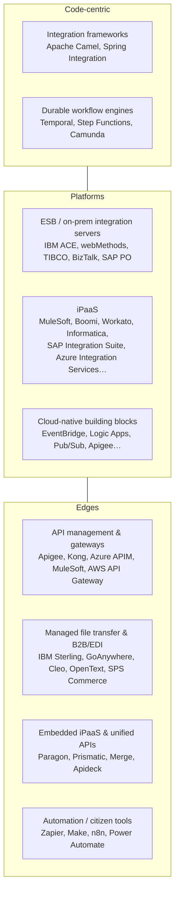

# Chapter 11. Integration Platforms: ESB, iPaaS, API Management and Embedded Integration

> "Buy the plumbing. Build the business logic."

## What you will learn

- The categories of integration technology: frameworks, ESBs, iPaaS, cloud-native integration services, API management, workflow engines, managed file transfer, B2B gateways, embedded iPaaS and unified APIs.
- The major vendors in each category *(as of October 2026)*, and what distinguishes them.
- How to evaluate and select a platform, and how to decide between building and buying.
- How the platforms are converging, and where AI fits into them.

> **A note on vendor information.** This chapter names many products to orient you. Vendor capabilities, ownership and pricing change constantly. Confirm details with the vendor and with independent references before you make decisions.

---

## 11.1 The landscape at a glance

---

## 11.2 Integration frameworks (build with code)

| Framework | Notes |
|---|---|
| **Apache Camel** | The most complete open-source implementation of the Enterprise Integration Patterns; hundreds of components (connectors); Java DSL, YAML DSL and XML; runs in Spring Boot or Quarkus, or as **Camel K** on Kubernetes. Red Hat build of Apache Camel is the supported distribution. |
| **Spring Integration** | EIP for the Spring ecosystem; pairs with Spring Cloud Stream (binder abstraction over Kafka and RabbitMQ). |
| **Apache NiFi** | Visual dataflow tool with strong provenance tracking; popular in government and data-heavy environments. |
| **Node-RED** | Low-code flow-based tool, popular in IoT. |
| **Ballerina** | A programming language from WSO2 designed for integration (network-aware types, sequence-diagram views). |
| **Language-native code** | Plain Python, Go, TypeScript, C# or Java services with good libraries (HTTP clients, broker SDKs, resilience libraries). Very common in product integration teams. |

**When code wins:** complex logic, high scale or performance needs, product integrations shipped as part of a SaaS product, teams with strong engineering skills, and a desire to avoid per-connection or per-message licensing.

---

## 11.3 Durable workflow and orchestration engines

| Product | Notes |
|---|---|
| **Temporal** | Durable execution: workflows written as code (Go, Java, TypeScript, Python, .NET, Ruby, PHP) whose state survives crashes; built-in retries, timers and signals. Self-hosted or Temporal Cloud. |
| **AWS Step Functions** | Serverless state machines (Amazon States Language, JSONPath or JSONata); direct integrations with 200+ AWS services. |
| **Azure Durable Functions** / **Logic Apps** | Code-based durable orchestration and visual workflows on Azure. |
| **Google Workflows** | Serverless orchestration on Google Cloud. |
| **Camunda** | BPMN-based process orchestration, strong where business process modelling and human tasks matter. |
| **Restate, Inngest, DBOS** | Newer durable-execution platforms. |
| **Apache Airflow, Dagster, Prefect** | Data-pipeline orchestration (Chapter 9), sometimes misused for operational integration. |

These engines are the modern answer to the "process manager" pattern and to sagas (Chapter 8).

---

## 11.4 ESBs and on-premises integration servers

Many large organisations still run these, and migrating off them is a major source of integration work.

| Product | Status *(October 2026)* |
|---|---|
| **IBM App Connect Enterprise (ACE)** | Successor to WebSphere Message Broker and IBM Integration Bus; containerised deployment supported; part of IBM's integration portfolio alongside IBM MQ, API Connect, Event Streams and, since the acquisition closed in July 2024, **webMethods** (bought from Software AG). |
| **IBM webMethods Hybrid Integration** | Integration Server, API management and B2B (Trading Networks). |
| **TIBCO BusinessWorks** | Part of Cloud Software Group; widely deployed in telecoms and finance. |
| **Microsoft BizTalk Server 2020** | **The final version.** Mainstream support ends in April 2028, with paid extended support to April 2030; Microsoft's guidance is to migrate to Azure Integration Services (Logic Apps). |
| **SAP Process Orchestration (PI/PO) 7.5** | Mainstream maintenance ends **31 December 2027**, optional extended maintenance to 2030; successor is **SAP Integration Suite**. SAP provides a Migration Assessment and a migration tool. |
| **Oracle SOA Suite / Oracle Service Bus** | Oracle's strategic direction is Oracle Integration (OIC). |
| **WSO2 Micro Integrator / Enterprise Integrator** | Open-source ESB lineage; WSO2 also offers a cloud iPaaS (Choreo / Devant). |
| **Red Hat Fuse** | Reached end of life in 2024; Red Hat build of Apache Camel is the replacement. |

### Migrating off an ESB

1. **Inventory** every interface: source, target, protocol, volume, frequency, owner and business criticality. There are always undocumented ones; mine the runtime logs.
2. **Classify** each interface: *retire* (no longer used), *rehost* (lift and shift), *refactor* (redesign on the new platform), *replace* (a SaaS-native connector now exists) or *consolidate*.
3. **Extract hidden business logic** from mappings and orchestrations, and decide where it belongs.
4. **Migrate in waves**, low-risk interfaces first, running old and new in parallel with reconciliation where possible.
5. **Decommission** the old platform, including credentials, firewall rules and certificates.

---

## 11.5 iPaaS (Integration Platform as a Service)

Gartner defines iPaaS as a vendor-managed cloud service that enables end users to implement integrations between a variety of applications, services and data sources. Typical capabilities:

- **Connectors** to hundreds or thousands of applications, protocols and databases.
- A **visual flow designer**, with scripting or expression languages for complex logic.
- **Data mapping and transformation** tools.
- **Runtime** in the vendor's cloud, plus **hybrid/on-premises agents** or runtimes for reaching private networks and meeting data-residency requirements.
- **API management** and publishing (in many platforms).
- **Event and messaging** features (queues, pub/sub).
- **B2B/EDI** modules (in some platforms).
- **Monitoring, error handling, retries and replay.**
- **Governance:** environments, deployment pipelines, role-based access and audit.
- Increasingly, **AI features:** natural-language flow generation, mapping suggestions, "agent" builders, and MCP server exposure of integrations.

### Market position *(as of October 2026)*

Gartner's **2025 Magic Quadrant for iPaaS** (May 2025) evaluated 16 vendors: Amazon Web Services, Boomi, Celigo, Frends, Huawei Cloud, IBM, Informatica, Jitterbit, Microsoft, Oracle, Salesforce (MuleSoft), SAP, SnapLogic, Tray.ai, Workato and Zapier. Vendor announcements for the **2026 Magic Quadrant** (March 2026) include Boomi (a Leader for the twelfth consecutive time, and highest for Ability to Execute) and Workato (a Leader for the eighth consecutive time, and furthest for Completeness of Vision). Treat analyst rankings as one input among many: they weight enterprise breadth and vendor strategy, which may not match your needs.

### Major iPaaS platforms

| Platform | Owner | Distinguishing traits | Typical buyer |
|---|---|---|---|
| **MuleSoft Anypoint Platform** | Salesforce (since 2018) | API-led connectivity; strong API management and design (Anypoint Design Center, Exchange); **DataWeave** transformation language; Mule runtime deployable in CloudHub 2.0, Runtime Fabric (customer-managed Kubernetes) or on premises; Anypoint MQ; heavy Salesforce and Agentforce integration. Developer-oriented (Anypoint Code Builder, based on VS Code). | Large enterprises with API strategies; Salesforce-centric organisations |
| **Boomi Enterprise Platform** | Boomi (private; owned by Francisco Partners and TPG since 2021) | Low-code; distributed runtimes (**Atoms** and **Molecules**) for hybrid deployment; master data hub; B2B/EDI; API management (expanded through acquisitions); AI agent features. | Mid-market to enterprise; hybrid estates |
| **Workato** | Workato (private) | "Recipes" built in a business-friendly designer; strong automation and orchestration focus; enterprise governance; **Workato Embedded** for SaaS vendors; positions itself around agentic orchestration. | Business-technology teams; fast-moving enterprises; SaaS vendors (embedded) |
| **Informatica Intelligent Data Management Cloud (IDMC)** | Salesforce (acquisition closed November 2025) | Data integration heritage (PowerCenter), plus application integration, API management, MDM, data quality and catalogue. | Data-heavy enterprises |
| **SAP Integration Suite** | SAP | Cloud Integration (formerly CPI), API Management, Event Mesh / Advanced Event Mesh, Integration Advisor (B2B mapping), Trading Partner Management, **Edge Integration Cell** (customer-managed runtime); prepackaged SAP-to-SAP and SAP-to-third-party content in the SAP Business Accelerator Hub. Designated successor to SAP PI/PO. | SAP customers |
| **Microsoft Azure Integration Services** | Microsoft | A set of services rather than one product: **Logic Apps** (workflows with 1,400+ connectors, Standard and Consumption plans), **API Management**, **Service Bus**, **Event Grid**, **Functions**, **Data Factory**, plus B2B/EDI through Integration Accounts. Power Automate for citizen use. | Microsoft-centric organisations; BizTalk migrations |
| **AWS integration services** | Amazon | Building blocks: EventBridge (bus, Pipes, Scheduler), Step Functions, SQS, SNS, MQ, API Gateway, AppFlow (SaaS data flows), B2B Data Interchange (EDI), Transfer Family (SFTP/AS2), Lambda. | AWS-native engineering teams |
| **Google Cloud** | Google | **Apigee** (API management), **Application Integration** and **Integration Connectors**, Pub/Sub, Eventarc, Workflows, Dataflow. | GCP customers; API-centric programmes |
| **Oracle Integration (OIC)** | Oracle | Adapters for Oracle Fusion, NetSuite and E-Business Suite; process automation; B2B. | Oracle application customers |
| **IBM webMethods Hybrid Integration / IBM App Connect** | IBM | Broad hybrid portfolio (MQ, Event Streams and now Confluent, API Connect, App Connect, webMethods, StreamSets). | Large regulated enterprises |
| **SnapLogic** | SnapLogic | "Snaps" pipelines; data and application integration; AI-assisted building. | Enterprises with mixed data and app needs |
| **Jitterbit Harmony** | Jitterbit | Low-code integration plus API management and app builder. | Mid-market |
| **Celigo** | Celigo | Strong NetSuite and e-commerce focus; prebuilt "integration apps". | NetSuite customers; e-commerce |
| **Tray.ai** | Tray.ai | Flexible low-code automation; AI agent builder; embedded option. | Technical business teams; SaaS vendors |
| **Frends** | Frends | Code-friendly low-code iPaaS (.NET-based), strong in the Nordics. | Mid-market, Europe |
| **TIBCO Cloud Integration** | Cloud Software Group | Cloud counterpart to BusinessWorks. | Existing TIBCO estates |

### Open-source and self-hostable automation

- **n8n** (fair-code licence): node-based workflow automation, popular for AI-agent workflows; self-hostable.
- **Apache Camel / Kaoto** (a visual designer for Camel), **Apache NiFi**, **Node-RED**.
- **Kestra**, **Windmill**: open-source orchestration and scripting platforms.
- **Airbyte** (data-integration focus).

---

## 11.6 Citizen automation tools

**Zapier, Make (formerly Integromat), Microsoft Power Automate, IFTTT** and others let non-engineers connect SaaS apps with triggers and actions. They deliver real value and real risk:

- **Value:** quick wins without engineering queues.
- **Risks:** shadow integrations nobody knows about; personal accounts holding company credentials; no error handling, so failures go unnoticed; data flowing to unapproved destinations; breakage when the creator leaves.

The integration engineer's role is to **enable with guardrails**: approved tool lists, connector allow-lists (Power Platform DLP policies, for example), service accounts instead of personal ones, a catalogue of automations, and a path to "graduate" critical automations to the governed platform. Chapter 17 discusses this as part of a Center for Enablement.

---

## 11.7 API management and gateways

**API management** covers the lifecycle of APIs you *provide*: design, security, publication, analytics, monetisation and retirement. Components:

| Component | Purpose |
|---|---|
| **API gateway** | Runtime enforcement: authentication, authorisation, rate limiting, quotas, request/response transformation, routing, caching, logging. |
| **Developer portal** | Documentation, API keys and app registration, sandbox access, self-service onboarding. |
| **Management plane** | API catalogue, policies, versioning, lifecycle states, analytics. |
| **Monetisation** | Plans, metering and billing (for public API products). |

Vendors *(October 2026)*: **Google Apigee**, **Kong** (Kong Gateway, Konnect; open-source core), **Microsoft Azure API Management**, **MuleSoft Anypoint API Manager / Flex Gateway**, **AWS API Gateway**, **IBM API Connect**, **Boomi API Management**, **Gravitee**, **Tyk**, **WSO2 API Manager**, **Axway Amplify**, **SAP API Management**, and lightweight or cloud-native gateways (**Envoy**-based gateways such as Envoy Gateway, Gloo and Emissary; **NGINX**; **Traefik**; the Kubernetes **Gateway API**). Several vendors now market **AI gateways** that apply rate limits, cost controls, prompt and response filtering, and routing to LLM APIs and MCP servers.

**Gateway versus service mesh:** a gateway manages **north–south** traffic (clients outside calling services inside). A service mesh (Istio, Linkerd, Cilium) manages **east–west** traffic between services inside a cluster (mTLS, retries and telemetry via sidecars or ambient proxies). They overlap and are often used together.

**Federated API management:** large organisations often end up with several gateways (one per cloud or business unit). Federated management tools catalogue and govern APIs across gateways.

---

## 11.8 Managed file transfer (MFT) and B2B integration

File-based and EDI integration remains huge (Chapter 13). Platforms:

| Category | Products |
|---|---|
| **Managed file transfer** | IBM Sterling File Gateway, Progress MOVEit, Fortra GoAnywhere, Axway SecureTransport, Cleo, JSCAPE, AWS Transfer Family, Azure Blob SFTP, Globalscape (Fortra) |
| **B2B / EDI integration** | IBM Sterling B2B Integrator, OpenText Business Network (formerly GXS), Cleo Integration Cloud, SPS Commerce (retail network), TrueCommerce, Orderful (API-first EDI), Stedi (API-first EDI), Boomi B2B/EDI, MuleSoft B2B, SAP Integration Advisor and Trading Partner Management, Azure Logic Apps Integration Accounts, AWS B2B Data Interchange |

MFT products are attractive targets: several were hit by mass-exploitation campaigns in 2023–2025 (notably MOVEit Transfer and GoAnywhere). Keep MFT servers patched, minimise their internet exposure, and monitor them closely.

---

## 11.9 Product integration platforms: embedded iPaaS and unified APIs

SaaS companies need to offer integrations to *their customers*. Options:

| Approach | How it works | Pros | Cons | Vendors *(Oct 2026)* |
|---|---|---|---|---|
| **Build in-house** | Your engineers write each integration | Full control; deep integrations; no per-connection fees | Slow; maintenance of every connector forever | — |
| **Embedded iPaaS** | An integration engine and marketplace embedded in your product; you (or customers) build workflows per target | Fast to add many integrations; customer-configurable; auth and infrastructure managed | Vendor dependency; per-connection pricing; less control | Paragon, Prismatic, Workato Embedded, Tray Embedded, Cyclr, Pandium, Integration.app (Membrane) |
| **Unified API** | One normalised API per category (HRIS, ATS, CRM, accounting, ticketing, file storage); the vendor maintains connectors to dozens of systems | One integration unlocks a whole category; managed auth and syncing | Lowest-common-denominator data models; custom fields need pass-through; some vendors store synced copies of customer data | Merge, Apideck, Unified.to, Kombo, Finch (HR/payroll), Codat and Rutter (accounting/commerce), Truto, Knit |

**How to choose (rule of thumb):** if customers need to *configure their own workflows and field mappings* inside your product, choose embedded iPaaS. If your product needs to *read and write data across a whole category* behind the scenes, choose a unified API. If an integration is core to your product's value and differentiation, build it in-house. Many companies mix all three.

**Evaluate carefully:** data residency and whether the vendor stores your customers' data; webhook and real-time support versus polling; custom-field handling; rate-limit management; pricing at scale; and the exit path if you outgrow the vendor.

---

## 11.10 Selecting a platform

### Evaluation criteria

| Area | Questions |
|---|---|
| **Fit to use cases** | API-led? Event-driven? Data pipelines? B2B/EDI? Product integrations? Citizen automation? |
| **Connectors** | Are the connectors you need available, maintained and deep (full API coverage, bulk operations, CDC, webhooks), or shallow? |
| **Developer experience** | Version control, CI/CD, local development, testing frameworks, code-level escape hatches, debugging. |
| **Runtime and deployment** | Cloud regions, hybrid agents, Kubernetes, data-residency options, private connectivity. |
| **Scalability and performance** | Throughput limits, concurrency, large payloads, streaming. |
| **Reliability features** | Retries, DLQs, replay, idempotency helpers, transactional behaviour. |
| **Observability** | Logs, metrics, tracing (OpenTelemetry export), alerting, payload search with masking. |
| **Security and compliance** | SSO, RBAC, secrets management, audit logs, certifications (SOC 2, ISO 27001, HIPAA BAA, PCI, FedRAMP). |
| **Governance** | Environments, approvals, asset reuse, API catalogue, policy enforcement. |
| **AI capabilities** | Assisted building and mapping; agent orchestration; MCP exposure; guardrails. Judge by demos on *your* use cases, not slides. |
| **Commercials** | Pricing model (per connection, per endpoint, per flow, per task/message, per vCore, per user); growth costs; contract terms. |
| **Ecosystem** | Talent availability, partners, community, training and certification. |
| **Vendor viability and direction** | Ownership changes (several major vendors changed hands in 2024–2026), roadmap, lock-in, exit strategy. |

### Running a selection

1. Write down 5–10 **representative use cases**, including your hardest one.
2. Shortlist 2–4 platforms.
3. Run a **time-boxed proof of concept** on the *same* use cases with your own engineers (not the vendor's sales engineers), measuring build time, operability and failure handling.
4. Model **three-year total cost of ownership**, including licences, infrastructure, people, training and migration.
5. Check **references** from customers like you.
6. Plan the **exit**: how would you leave in five years?

### Build versus buy

| Favour building (code) | Favour buying (platform) |
|---|---|
| Integration is core product value | Integration is internal plumbing |
| Few targets, deep integration | Many targets, standard patterns |
| Strong engineering team | Limited engineering capacity; business technologists available |
| Extreme scale or latency needs | Moderate volumes |
| Licensing costs at scale would dominate | Speed to deliver matters most |
| Need full control of data path | Prebuilt connectors cover the needs well |

Most organisations land on a **hybrid**: an iPaaS for the long tail of SaaS and enterprise integrations, code (with durable workflow engines and brokers) for high-scale or product-critical flows, and API management across both.

---

## 11.11 Trends *(as of October 2026)*

1. **Consolidation:** Salesforce (MuleSoft + Informatica), IBM (MQ, App Connect, webMethods, StreamSets, Confluent), Fivetran + dbt, and others. Integration capabilities are being folded into larger data and AI platforms.
2. **Agentic integration:** every major iPaaS markets agent builders, AI-assisted development, and exposing integrations as **MCP servers** or agent tools. The underlying engineering needs (contracts, auth, idempotency, observability) are unchanged (Chapter 18).
3. **API management meets event management and AI gateways:** single control planes for REST, events and LLM or MCP traffic.
4. **On-premises sunsets:** SAP PO (2027) and BizTalk (2028) drive migration programmes.
5. **Hybrid and sovereign runtimes:** customer-managed data planes (MuleSoft Runtime Fabric, SAP Edge Integration Cell, Boomi runtimes, Azure Arc-enabled Logic Apps) respond to data-residency demands.
6. **Developer experience convergence:** low-code tools add Git, CI/CD and code views; code frameworks add visual designers.

---

## Summary

- Integration technology spans frameworks, workflow engines, ESBs, iPaaS, cloud building blocks, API management, MFT/B2B, embedded iPaaS, unified APIs and citizen tools.
- The iPaaS market is led by large, increasingly consolidated vendors; choose by your use cases, developer experience, operability, compliance and total cost, not by quadrant position alone.
- ESB sunsets (SAP PO 2027, BizTalk 2028) make migration a major work stream.
- SaaS vendors choose among building, embedded iPaaS and unified APIs per integration.
- Most organisations need a deliberate hybrid, with governance spanning all of it.

## Exercises

See [`exercises/11-platforms.md`](../exercises/11-platforms.md).

## Further reading

- Gartner, *Magic Quadrant for Integration Platform as a Service* (2025 and 2026 editions; vendor-distributed reprints are usually available).
- MuleSoft, *API-led connectivity* white papers; Microsoft *Azure Integration Services* landing zone accelerator; SAP *Integration Solution Advisory Methodology (ISA-M)*.
- Apache Camel documentation (camel.apache.org).
- Temporal documentation on durable execution (docs.temporal.io).
