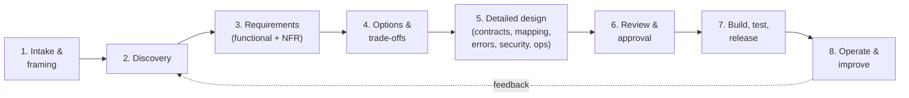
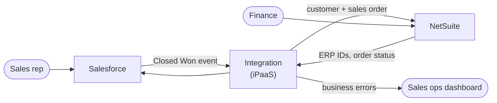
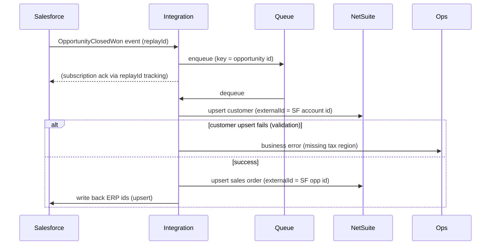

# Chapter 14. The Integration Design Process

> "Weeks of coding can save you hours of planning."
> (programmer proverb, ironic)

## What you will learn

- An end-to-end process for designing an integration, from first conversation to approved design.
- How to run discovery with business stakeholders and system owners.
- How to capture functional and non-functional requirements that integrations actually need.
- The diagrams that matter: context, sequence, data-flow and C4.
- How to write an integration design document, mapping specification and Architecture Decision Records (ADRs).
- How to run a design review, and how to estimate integration work.

This chapter is where the title's "Design" earns its place. Many engineers can build an integration; fewer can lead a group of people from "we need these systems to talk" to a design that survives production.

---

## 14.1 The process at a glance



The process scales. A simple webhook-to-Slack notification might take an hour and a one-page design. A new ERP rollout's integration programme might take months, with dozens of interface specifications. The steps stay the same; only the depth changes.

---

## 14.2 Step 1: intake and framing

Start by framing the request in one paragraph:

> *"When a deal is marked Closed Won in Salesforce, the finance team needs a customer and a sales order created in NetSuite within 15 minutes, so that invoicing can start the same day. Today this is re-keyed manually, taking about 20 minutes per deal and causing about 3% data-entry errors."*

A good frame names:

- the **business event** that starts the process (a deal closes);
- the **outcome** needed (customer and sales order exist in the ERP);
- the **timeliness** need (within 15 minutes);
- the **value** (time saved, errors avoided, revenue acceleration);
- the **current state** (manual re-keying).

If you cannot write this paragraph, you are not ready to design. Also identify the **sponsor** (who wants it and will accept it), the **system owners** (who control each system), and the **users** affected.

---

## 14.3 Step 2: discovery

Discovery uncovers how things *really* work. Plan for three kinds of activity.

### 2a. Process discovery (with business users)

Walk through the business process with the people who do it today. Ask:

- "Show me how you do this today, step by step." (Watch; do not just listen.)
- "What triggers this? What happens next?"
- "What are the exceptions? What do you do when X is missing or wrong?"
- "How often does this happen? On which days or at which times? What is the busiest day of the year?"
- "What happens if it is late? If it is wrong? Who notices, and how?"
- "Who else uses this data?"
- "Which system do you trust when they disagree?"

Exceptions are where integrations fail. Ask about them repeatedly: cancellations, amendments, partial shipments, refunds, merges, currency changes, period close, returns, duplicates and test data.

### 2b. System discovery (with system owners and documentation)

For each system, use the checklist in Chapter 12 §12.1: APIs, authentication, limits, change detection, bulk options, upsert keys, customisation, environments, release cycle and support contacts. Also:

- Get **sandbox access** early. It often takes weeks.
- Pull **real sample data** (anonymised if needed), including messy records.
- Identify **existing integrations** touching the same objects. Will yours conflict with them?
- Identify **automation inside the systems** (triggers, workflows, validation rules) that your writes will fire.

### 2c. Constraint discovery

- **Security and compliance:** what data categories are involved? Which regions? Which contracts and approvals are needed (DPAs, BAAs, security reviews)?
- **Network:** where do the systems live? Are IP allow-lists, VPNs or private links needed?
- **Platform:** which integration platform must or may be used? Any licensing limits?
- **Organisation:** who will support it after go-live? What are their skills? What change-management processes apply?
- **Timeline and budget.**

### Discovery outputs

- A **context diagram** (§14.6).
- A **process flow** with exceptions.
- A **system inventory** for the integration (APIs, limits, owners).
- An **entity list** with **system of record** per entity (and per field where needed).
- **Sample payloads.**
- A **risks and open questions** list.

---

## 14.4 Step 3: requirements

### Functional requirements

Express them as **integration scenarios**: one per trigger and outcome, written so a tester can verify them.

| ID | Scenario | Trigger | Expected outcome |
|---|---|---|---|
| F-01 | New customer | Opportunity → Closed Won, account not yet in ERP | Customer created in ERP with external ID = SF account ID; ERP ID written back to SF |
| F-02 | Existing customer | Closed Won, account already linked | No new customer; sales order linked to existing ERP customer |
| F-03 | Sales order | Closed Won | Sales order with lines from opportunity products, prices, currency, PO number |
| F-04 | Amendment before invoicing | Opportunity products changed after Closed Won, order not yet billed | ERP order updated |
| F-05 | Amendment after invoicing | Same, but order billed | No automatic change; task created for finance |
| F-06 | Missing tax code | Account lacks tax region | Order not created; error visible to sales ops with reason; auto-retry after fix |

### Non-functional requirements (NFRs)

Integrations fail on NFRs far more than on functional logic. Capture these explicitly:

| Category | Questions | Example |
|---|---|---|
| **Volume** | Average and peak events per unit time? Record sizes? Growth? Backfill volume? | Avg 200 deals/day; peak 1,500 on quarter-end day; initial backfill of 40,000 open orders |
| **Latency / freshness** | End-to-end time from trigger to outcome? | 95% within 15 minutes; 100% within 4 hours |
| **Availability** | Hours of operation? Acceptable downtime? Behaviour when a system is down? | Must queue during ERP maintenance windows and catch up without manual action |
| **Ordering** | Must events be processed in order? Per what key? | Per opportunity |
| **Consistency** | Eventual consistency acceptable? Reconciliation tolerance? | Daily reconciliation; zero unexplained differences |
| **Data quality** | Validation rules; reject or fix? | Reject orders lacking tax region; surface to sales ops |
| **Security** | Data classification; authentication; least-privilege scopes | Contains customer PII; OAuth JWT bearer with dedicated integration users |
| **Compliance / audit** | Retention; audit trail; regulations | SOX: GL-affecting; keep 7 years of audit trail of changes made by the integration |
| **Observability** | What must be monitored? Who is alerted? | Alert finance-ops on business errors; alert integration on-call on technical errors |
| **Recoverability** | Replay window; RPO/RTO | Ability to replay any 7-day window |
| **Supportability** | Who supports it? Runbooks? Tooling for business users to fix errors? | Sales ops can see and resubmit failed records from a dashboard |
| **Cost** | Licence, API-call and infrastructure budgets | Must stay within the SF daily API allocation shared with 6 other integrations |
| **Maintainability** | Change frequency; who changes mappings? | Finance changes value maps quarterly without a deployment |

Write NFRs as **measurable** statements. "Fast" is not a requirement; "95% of orders created in ERP within 15 minutes of Closed Won, measured monthly" is.

---

## 14.5 Step 4: options and trade-offs

Before detailed design, lay out two or three viable options and compare them. For the example:

| Option | Description | Pros | Cons |
|---|---|---|---|
| A. iPaaS polling | iPaaS polls SF every 5 min for Closed Won opportunities, creates records in ERP | Simple, uses existing platform | Up to 5-min lag; API calls even when idle; must handle overlap and duplicates |
| B. Event-driven via platform events | SF publishes a Platform Event on Closed Won (via Flow); iPaaS subscribes via Pub/Sub API; queues; creates ERP records | Near real time; no idle polling; replay via event bus (72 h) | Needs SF Flow change (SF admin team); 72-hour replay window must be covered by a reconciliation job |
| C. Native connector | Use the vendor's packaged SF–ERP connector | Fastest to deliver | Limited mapping flexibility; does not support F-05 workflow; licence cost |

**Recommendation:** B, with a daily reconciliation job (from option A's query logic) as a safety net.

Record the decision in an **Architecture Decision Record** (§14.9).

**Trade-off thinking tools:**

- Name the **quality attributes** in tension (latency versus simplicity; flexibility versus time to market).
- Consider **reversibility**: prefer options that are easy to change later when uncertainty is high.
- Consider **total cost of ownership**, not just build cost. Who runs this at 3 a.m.?
- Consider the **organisation**: an elegant design the support team cannot operate is a bad design.

---

## 14.6 Diagrams that matter

### Context diagram

Shows the integration's scope: systems, actors and flows, without internals. Every design starts here.



### Sequence diagram

Shows the order of interactions, including failure paths. This is the best diagram for reviewing reliability.



### Data-flow diagram with trust boundaries

Used for security reviews and threat modelling (Chapter 10): processes, data stores, flows and the boundaries between networks or organisations.

### C4 model

Simon Brown's **C4 model** gives four zoom levels: **Context** (systems and people), **Container** (applications, data stores and runtimes), **Component** (inside a container) and **Code**. Context and Container diagrams cover most integration documentation needs. Tools such as Structurizr, Mermaid's C4 syntax, IcePanel and draw.io support it.

### Other useful views

- **State diagrams** for entities with lifecycles (order states and which transitions trigger integration events).
- **Integration landscape maps** showing all integrations in a domain (Chapter 17).
- **Swimlane process diagrams (BPMN)** when business users need to validate the process.

Store diagrams **as code** (Mermaid, PlantUML, Structurizr DSL) beside the design document in version control, so they stay current and can be reviewed in pull requests. The [`diagrams/`](../diagrams/) folder contains the diagrams from this book in Mermaid.

---

## 14.7 Step 5: detailed design

Detailed design covers each aspect discussed in Parts II and III. The **integration design document (IDD)** pulls them together. A full template is in [`templates/integration-design-document.md`](../templates/integration-design-document.md). Its sections:

1. **Summary:** frame, scope, decision summary.
2. **Context:** context diagram, systems, owners, environments.
3. **Scenarios:** functional requirements (F-xx).
4. **Non-functional requirements:** NFR table with measurable targets.
5. **Architecture:** style and patterns (named in EIP terms), container diagram, sequence diagrams per scenario including failure paths.
6. **Interfaces and contracts:** endpoints, events, files; OpenAPI/AsyncAPI links; authentication; versions; limits.
7. **Data mapping:** link to the mapping specification; key strategy; system of record per field; value maps.
8. **Error handling and reliability:** error classification table; retries; idempotency keys; DLQs and business error queues; circuit breakers; replay; reconciliation.
9. **Security and compliance:** data classification; authentication and scopes; secrets; encryption; data minimisation; logging and redaction; threat model; compliance notes.
10. **Observability and operations:** metrics, logs, traces, dashboards, alerts (who and when), runbook link, SLOs.
11. **Deployment:** environments, configuration, CI/CD, infrastructure as code, cut-over and backfill plan, rollback plan.
12. **Testing strategy:** unit, contract, integration, end-to-end, performance, UAT scenarios (Chapter 15).
13. **Risks, assumptions, open questions.**
14. **Decisions:** links to ADRs.
15. **Appendices:** samples, glossary.

### Writing well

- Write for the **on-call engineer two years from now** who has never met you.
- Prefer tables and diagrams to paragraphs for facts; use prose for *reasoning*.
- State **assumptions** explicitly ("We assume the ERP maintenance window remains Sundays 02:00–04:00 UTC").
- Make **open questions** visible, with owners and due dates.
- Keep the document **alive**: update it when the design changes, and link it from the runbook and the catalogue.

### The mapping specification

Covered in Chapter 4 §4.5, and templated in [`templates/data-mapping-spec.md`](../templates/data-mapping-spec.md). Usually a spreadsheet or a Markdown/CSV table in version control. It is reviewed field by field with the business owner of each target system.

### Interface specification for partners

When integrating with an external partner, write an **interface agreement** or **interface control document**: transport, endpoints, authentication, message formats and samples, acknowledgement rules, error codes, SLAs, support contacts, change-notification process, test plan and go-live criteria. Both parties sign it off. A template is in [`templates/interface-agreement.md`](../templates/interface-agreement.md).

---

## 14.8 Cut-over, backfill and migration planning

New integrations rarely start from empty systems.

- **Initial load / backfill:** how will existing records be loaded or linked? Use bulk APIs, run outside business hours, isolate them from the real-time flow (Chapter 8 bulkheads), and plan for duplicates and matching (Chapter 9).
- **Matching existing records:** if both systems already contain the same customers, define matching rules and a manual review step for ambiguous matches before enabling sync.
- **Cut-over sequence:** freeze manual processes, run the backfill, enable real-time flow, verify with reconciliation, then hand over to operations.
- **Parallel running:** for replacements (ESB migrations), run old and new side by side and compare outputs before switching.
- **Feature flags and gradual rollout:** enable per tenant, per region or per percentage of traffic.
- **Rollback plan:** how to disable the new flow, how to clean up partial data, and how to fall back to the old process.

---

## 14.9 Architecture Decision Records (ADRs)

An **ADR** (popularised by Michael Nygard in 2011) captures one significant decision with its context and consequences. ADRs are short (one page), numbered, immutable once accepted (superseded rather than edited), and stored with the code or design.

```markdown
# ADR-007: Use Salesforce Platform Events + Pub/Sub API to trigger ERP order creation

Status: Accepted (2026-10-09)

## Context
Finance needs ERP orders within 15 minutes of Closed Won. Polling every 5 minutes
consumes ~8,600 API calls/day from a shared allocation that is already 70% used.

## Decision
Publish a custom Platform Event from a record-triggered Flow on Closed Won;
subscribe via Pub/Sub API from the iPaaS; persist replayId; queue for processing.
Add a daily reconciliation query as a safety net for the 72-hour replay window.

## Consequences
+ Near-real-time; ~0 idle API calls.
− Requires SF admin change and Flow maintenance by the CRM team.
− Must monitor subscriber lag; outages > 72 h require reconciliation-based recovery.

## Alternatives considered
Polling (Option A); native connector (Option C). See IDD §5.
```

A template is in [`templates/adr.md`](../templates/adr.md).

---

## 14.10 Step 6: the design review

Reviews catch the problems that are cheapest to fix now. Invite the system owners, a security reviewer, the operations or support owner, and a peer integration engineer.

**A review agenda (60–90 minutes):**

1. Frame and scope (5 min).
2. Walk the context and sequence diagrams for each scenario, including failure paths (30 min).
3. Mapping highlights and data ownership (10 min).
4. Security and compliance (10 min).
5. Operations: alerts, runbooks, replay, reconciliation (10 min).
6. Risks, open questions, decisions (10 min).

**Questions reviewers should ask** (also a checklist in [Appendix D](../appendices/D-checklists.md)):

- What happens if each system is down for an hour? For three days?
- What happens if this message arrives twice? Out of order? Never?
- How do we know it is working? How do we know when it is not?
- Who gets paged, and what do they do?
- What is the blast radius of these credentials?
- How do we replay after a bug fix?
- What is the busiest day of the year, and have we tested it?
- What happens at the first API version deprecation?
- Who owns this in a year?

Record actions and decisions; update the document; get explicit sign-off from the sponsor and system owners.

---

## 14.11 Estimating integration work

Integration estimates are notoriously optimistic, because the unknowns live in other people's systems. Practical guidance:

- **Estimate per interface and per scenario**, not per project.
- **Classify complexity** with explicit drivers: number of fields mapped; number of systems; protocol (REST easy, SOAP/EDI harder, custom file formats hardest); synchronous or asynchronous; bidirectional or not; volume; transformation complexity; partner responsiveness; sandbox availability; compliance requirements.
- **Add explicit time for:** access and credentials (often the longest lead time), partner testing cycles, data-quality remediation, UAT with business users, performance testing, cut-over and hypercare.
- **Spike first:** a one- to three-day spike against the real sandbox reduces the biggest unknowns ("can we even authenticate?" "does the upsert work with custom fields?").
- **Track actuals** against estimates to calibrate future work.

A common rough sizing scheme *(illustrative; calibrate to your organisation)*:

| Size | Example | Typical effort (design + build + test) |
|---|---|---|
| Small | One-way, one entity, REST-to-REST, < 20 fields, existing connectors | 3–10 days |
| Medium | One-way, 2–3 entities, some lookups, error queue, reconciliation | 2–4 weeks |
| Large | Bidirectional, multiple entities, conflict rules, backfill, partner testing | 1–3 months |
| Very large | New EDI partner programme, ERP replacement interfaces, regulated data | Programme-level planning |

---

## 14.12 Working with people

Integration design is as much social as technical:

- **You are a translator** between business language and technical language, and between teams with different priorities. Use the business's terms in documents; define technical terms.
- **System owners have their own roadmaps.** Ask early, explain value, and minimise what you need from them.
- **Partners are slow** (through no fault of their own; you are one of many customers). Get contacts, escalation paths and test windows agreed up front.
- **Disagreements about data ownership are business decisions.** Escalate them to the sponsor with clear options rather than resolving them silently in a mapping.
- **Write things down and share them.** Decisions made in meetings are forgotten; decisions in an ADR survive.

---

## Summary

- Follow a repeatable process: frame, discover, specify requirements (especially measurable NFRs), compare options, design in detail, review, then build and operate.
- Discovery is about exceptions, real data and constraints; get sandbox access and samples early.
- Use context, sequence and data-flow diagrams (C4 for structure); keep them as code.
- Write an integration design document, a mapping specification, interface agreements for partners, and ADRs for decisions.
- Plan backfill, matching, cut-over and rollback, not just the steady state.
- Run structured design reviews and estimate with explicit complexity drivers.

## Exercises

See [`exercises/14-design-process.md`](../exercises/14-design-process.md).

## Further reading

- Simon Brown, *The C4 model for visualising software architecture* (c4model.com).
- Michael Nygard, "Documenting Architecture Decisions" (2011); adr.github.io.
- Gregor Hohpe, *The Software Architect Elevator* (O'Reilly, 2020).
- Len Bass, Paul Clements and Rick Kazman, *Software Architecture in Practice*, 4th edition (Addison-Wesley, 2021), on quality attributes.
- Neal Ford, Mark Richards, Pramod Sadalage and Zhamak Dehghani, *Software Architecture: The Hard Parts* (O'Reilly, 2021), on distributed trade-offs.
