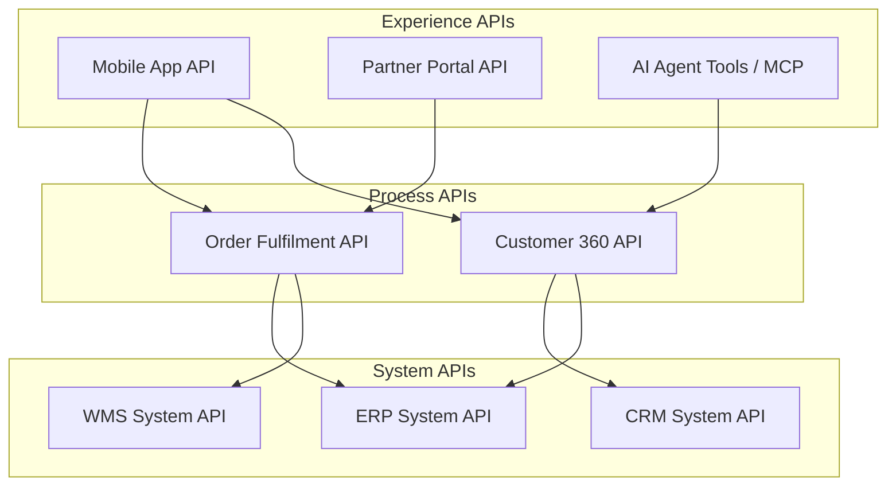
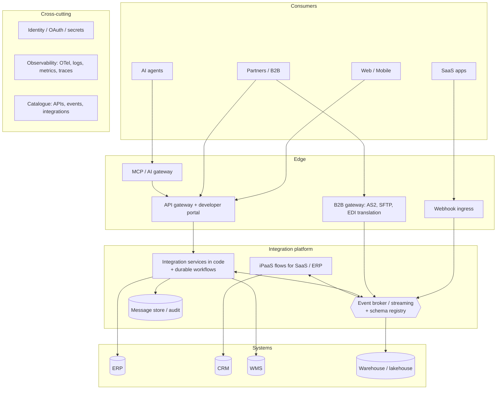

# Chapter 17. Integration Architecture and Governance

> "Architecture is the decisions that you wish you could get right early in a project."
> (Ralph Johnson, as quoted by Martin Fowler)

## What you will learn

- Integration topologies: point-to-point, hub-and-spoke, bus, API layers, event-driven and mesh, and how real estates mix them.
- API-led connectivity: what it is, when it helps, and how it goes wrong.
- Event-driven architecture at enterprise scale; data mesh and data products.
- Domain-driven design for integration: bounded contexts, anti-corruption layers, context maps.
- Legacy modernisation: strangler fig, façades and migration strategies.
- Governance that enables rather than blocks: standards, API style guides and linting, catalogues, reuse, lifecycle and deprecation, Centers for Enablement, and team topologies.

---

## 17.1 From integrations to an integration architecture

One integration is a project. Fifty integrations are an **estate**, and without architecture they become spaghetti. Integration architecture answers estate-level questions:

- Which **topologies and styles** do we use, and when?
- Which **platforms** do we standardise on?
- What **standards** (API style, event schemas, security, observability) apply to every integration?
- Who **owns** each integration, API and event?
- How do teams **discover and reuse** what exists?
- How do we **change and retire** interfaces without breaking consumers?

The Integration Design Engineer contributes to these answers early in a career and, as an architect, owns them later.

---

## 17.2 Topologies

| Topology | Description | Strengths | Weaknesses |
|---|---|---|---|
| **Point-to-point** | Each pair of systems connected directly | Simple for a few systems; no central dependency | Up to *n(n−1)/2* links; no visibility; duplicated logic |
| **Hub-and-spoke** | All traffic through a central hub (EAI, iPaaS) | Central visibility; reusable adapters; canonical model | Central bottleneck (technical and organisational); single point of failure |
| **Bus (ESB)** | Shared messaging backbone with mediation | Decoupling; protocol mediation | Logic accumulates in the bus; complexity |
| **API layers** | Systems expose APIs; consumers compose them, often in layers (§17.3) | Reuse; self-service; clear contracts | Synchronous coupling; layering overhead |
| **Event-driven** | Producers publish events to a broker; consumers subscribe | Loose coupling; fan-out; scalability | Harder to see the end-to-end process; eventual consistency |
| **Mesh / federated** | Multiple brokers, gateways and platforms federated under common governance | Fits large, decentralised organisations | Requires strong standards and catalogues |

Real estates are **hybrids**: APIs for queries and commands that need answers, events for facts many systems care about, files for bulk and partner exchange, and an iPaaS for the long tail of SaaS-to-SaaS automation. The architect's job is to make the hybrid *intentional*, with clear guidance on which style to use for which need (Chapter 5 §5.1).

---

## 17.3 API-led connectivity

**API-led connectivity**, popularised by MuleSoft, organises APIs into three layers:

- **System APIs** wrap systems of record, hiding their complexity and protocols (SOAP, IDocs, SQL) behind clean, stable interfaces. They are owned by the teams closest to those systems.
- **Process APIs** compose system APIs into business capabilities (fulfil an order, provide a customer view). They contain orchestration and business logic.
- **Experience APIs** tailor data for specific consumers (mobile, partner portal, AI agent), similar to the **Backend-for-Frontend** pattern.

**Benefits:** reuse (the ERP System API is built once and used by many), decoupling consumers from back-end changes (replace the ERP behind the System API), and clear ownership by layer.

**Pitfalls:**

- **Layering by default:** three hops for every call add latency, cost and failure points. Not every integration needs all three layers. A simple sync might go straight to a system API.
- **Anaemic layers:** process APIs that simply pass through add cost without value.
- **Reuse that never materialises:** "build it reusable" can mean over-engineering for imagined consumers. Build for real consumers, and generalise when the second and third arrive.
- **Synchronous everything:** API-led architectures can become distributed monoliths. Combine with events for facts that many consumers need.
- **Licensing economics:** some platforms charge per runtime or vCore, which makes many small APIs expensive.

Use the layers as a **vocabulary and a guide**, not as mandatory plumbing.

---

## 17.4 Event-driven architecture at scale

When events become the main integration backbone:

- **Event ownership:** each event type has one owning domain (producer) responsible for its schema and quality.
- **Event catalogue:** every event documented (AsyncAPI), discoverable (EventCatalog, the schema registry, a developer portal), with owners, consumers, schemas, SLAs and examples.
- **Schema governance:** a schema registry with compatibility rules enforced at publish time (Chapter 4).
- **Topic naming conventions:** for example `<domain>.<entity>.<event>.<version>` such as `sales.order.placed.v1`, plus environment and data-classification tags.
- **Access control:** who may produce to and consume from each topic; personal data classification.
- **Retention and replay policy** per topic class.
- **Event versus command discipline:** events are facts owned by producers; commands are requests addressed to a specific handler.
- **Event mesh** for multi-region and hybrid estates (Chapter 7).

A useful mental model, from data-on-the-outside thinking (Pat Helland): data *inside* a service is private and mutable; data *outside* (events, API responses) is an immutable, versioned, published fact. Treat outside data as a product.

---

## 17.5 Data mesh and data products

**Data mesh** (Zhamak Dehghani, 2019) proposes four principles for analytical data: **domain ownership**, **data as a product**, a **self-serve data platform** and **federated computational governance**. For integration architects, its relevance is:

- Domains publish **data products** (datasets and streams) with contracts, SLAs and owners, the same discipline as APIs and events.
- **Data contracts** (Chapter 9) are the interface agreements for those products.
- Governance is **federated**: global standards (identifiers, privacy classification, interoperability formats) are automated in the platform; domains decide the rest.

Even organisations that do not adopt data mesh wholesale borrow its ideas of product thinking and federated governance for integration estates.

---

## 17.6 Domain-driven design for integration

**Domain-driven design** (DDD; Eric Evans, 2003) offers tools that map directly onto integration problems:

- **Bounded context:** a boundary within which a model and its language are consistent. "Customer" in Sales (a prospect company) and "Customer" in Billing (a paying account) are different models in different contexts. Integration happens *between* bounded contexts.
- **Ubiquitous language:** use the business's terms consistently within a context, and name integration events in them.
- **Context map:** a diagram of bounded contexts and their relationships. Relationship patterns include:
  - **Customer–Supplier:** downstream needs influence the upstream's plans.
  - **Conformist:** the downstream adopts the upstream's model as is (common with SaaS: you conform to Salesforce's model).
  - **Anti-Corruption Layer (ACL):** the downstream translates the upstream model into its own, protecting its domain from the other's concepts. **Every integration with a third-party system should have one**, a client module or System API that translates vendor concepts into yours.
  - **Open Host Service / Published Language:** the upstream offers a well-documented protocol and model for many consumers (a public API, an industry standard such as FHIR).
  - **Shared Kernel:** a small, shared model maintained jointly (use sparingly).
  - **Separate Ways:** no integration; duplication is cheaper.

Event storming (Alberto Brandolini) is a workshop technique for discovering domain events and boundaries with business experts. It works well during integration discovery (Chapter 14).

---

## 17.7 Legacy modernisation

Integration engineers are at the centre of modernisation, because legacy systems are replaced *through* their interfaces.

- **Strangler fig pattern** (Martin Fowler): put a façade (API gateway, proxy or event interception) in front of the legacy system; route functionality piece by piece to new implementations; retire the legacy when nothing routes to it.
- **Façade / System API over legacy:** expose the mainframe or old ERP through a clean API, decoupling consumers so the back end can later be replaced without them noticing.
- **Event interception and CDC:** capture changes from the legacy database (Chapter 9) to feed new systems without modifying legacy code.
- **Parallel run and reconciliation:** run old and new together and compare (Chapter 15).
- **Integration migration** (ESB to iPaaS, PI/PO to Integration Suite, BizTalk to Logic Apps): inventory, classify (retire, rehost, refactor, replace), migrate in waves (Chapter 11 §11.4).
- **Mainframe integration:** IBM z/OS Connect (REST APIs over CICS and IMS programs), MQ bridges, CDC (IBM InfoSphere / IBM Data Replication, Precisely, Qlik) and file transfer remain the main options.

---

## 17.8 Governance that enables

"Governance" has a bad reputation from SOA-era review boards that slowed everything down. Modern integration governance aims to make **the right way the easy way**:

### Standards and guidelines

Publish short, practical standards:

- **API style guide:** naming, casing, pagination, errors (RFC 9457), versioning, security, documentation requirements. Base it on a public guide (Zalando, Microsoft, Google AIP) rather than writing your own from scratch.
- **Event guidelines:** naming, CloudEvents envelope, schema registry and compatibility, ownership.
- **Security baseline:** approved authentication methods, secrets management, logging redaction.
- **Observability baseline:** required log fields, trace propagation, standard dashboards and alerts.
- **Integration style decision guide:** when to use API, event, file or iPaaS flow.

### Automate the standards

- **API linting** in CI with **Spectral** or **Redocly CLI** rulesets that encode the style guide; fail builds on violations.
- **Schema compatibility** enforced by the registry.
- **Templates and scaffolding** (project generators, Backstage software templates, iPaaS project templates) that start every integration compliant: logging, tracing, retries, DLQ, health checks and CI pipeline included.
- **Policy as code** in gateways (authentication, rate limits) applied by default.

### Catalogue everything

An **integration and API catalogue** is the single most valuable governance artefact. For each integration, API and event:

- owner (team and person), business purpose, criticality;
- connected systems and environments;
- interfaces (links to OpenAPI and AsyncAPI documents), versions in use, deprecation dates;
- data classification and compliance notes;
- runbook, dashboards and design document links;
- credentials used (by reference) and their expiry.

Tools: **Backstage** (Spotify's open-source developer portal) with API and system entities; API management portals; iPaaS asset catalogues (Anypoint Exchange, for example); event catalogues; or, at minimum, a well-maintained spreadsheet or wiki. The catalogue enables impact analysis ("who uses the ERP customer API v1?"), deprecation, audits and onboarding, and mitigates OWASP API9 (improper inventory).

### Lifecycle management

Every interface moves through states: **design → review → published → deprecated → retired**. Governance defines:

- design review requirements (proportional to risk: a public API needs more than an internal sync);
- versioning and deprecation policy with minimum notice periods (Chapter 6);
- consumer registration, so you know whom to notify;
- retirement procedure (Chapter 16 §16.9).

### Proportionality

Not every integration needs the same rigour. Tier integrations by **criticality** (business impact if they fail) and **exposure** (internal, partner, public) and scale the required documentation, review, testing and SLOs accordingly.

---

## 17.9 Organisational models

### Centralised integration team (Integration Competency Centre)

A central team builds and runs all integrations. Consistent and expert, but a bottleneck as demand grows, and distant from domain knowledge.

### Center for Enablement (C4E)

Popularised by MuleSoft: a small central team provides **platforms, standards, reusable assets, templates, training and coaching**, while **domain and project teams build their own integrations**. The C4E measures success by reuse and by other teams' delivery speed, not by how many integrations it builds itself.

### Platform team model (Team Topologies)

In Matthew Skelton and Manuel Pais's *Team Topologies* vocabulary:

- **Stream-aligned teams** own business domains and their integrations.
- An **integration platform team** provides the brokers, gateways, iPaaS, observability and templates as a self-service internal product.
- **Enabling teams** (often the integration architects) coach stream-aligned teams on patterns and standards.
- **Complicated-subsystem teams** own genuinely specialised areas (an EDI/B2B team; a SAP integration team).

### Fusion teams and citizen integrators

Business technologists build automations on governed low-code tools, with guardrails (approved connectors, service accounts, a catalogue, and a path to promote critical automations to the professional platform), supported by the C4E or platform team.

Most large organisations evolve from centralised, to C4E, to a platform model, keeping specialist teams for B2B/EDI and major ERPs.

---

## 17.10 Architecture fitness functions

**Fitness functions** (from *Building Evolutionary Architectures*, Ford, Parsons and Kua) are automated checks that the architecture keeps its desired properties:

- API specs pass linting; no breaking changes without a major version.
- No new direct database connections between domains (detected through network or credential inventory).
- Every service propagates trace context (tested in CI).
- Event schemas registered and compatible.
- Every integration in production has an owner, runbook and catalogue entry (checked against the catalogue).
- No credentials expiring within 14 days without a rotation ticket.
- p99 end-to-end latency for critical flows within SLO.

Run them continuously, and display them on a dashboard the whole engineering organisation can see.

---

## 17.11 Reference architecture: a modern integration estate *(illustrative)*

Not every organisation needs every box. A 50-person SaaS company might have a gateway, one queue service, a handful of integration services and a catalogue in a spreadsheet. The *concerns* are the same at every scale: entry points, a backbone, durable processing, systems of record, and cross-cutting identity, observability and catalogue.

---

## Summary

- Architect the estate as an intentional hybrid of topologies, with clear guidance on which style fits which need.
- Use API-led layering as a vocabulary, not mandatory plumbing; combine APIs with events.
- Govern event-driven architectures with ownership, catalogues, schema registries and naming conventions.
- Apply DDD: bounded contexts, context maps, and an anti-corruption layer for every third-party system.
- Modernise legacy through façades, strangler figs, CDC and parallel runs.
- Make governance enabling: short standards, automated linting and templates, a complete catalogue, lifecycle policies and proportional rigour.
- Organise around a platform/C4E model with stream-aligned ownership, and check architectural properties continuously with fitness functions.

## Exercises

See [`exercises/17-architecture-and-governance.md`](../exercises/17-architecture-and-governance.md).

## Further reading

- Eric Evans, *Domain-Driven Design* (Addison-Wesley, 2003); Vaughn Vernon, *Implementing Domain-Driven Design* (2013).
- Matthew Skelton and Manuel Pais, *Team Topologies*, 2nd edition (IT Revolution, 2025).
- Neal Ford, Rebecca Parsons, Patrick Kua and Pramod Sadalage, *Building Evolutionary Architectures*, 2nd edition (O'Reilly, 2022).
- Zhamak Dehghani, *Data Mesh* (O'Reilly, 2022).
- Pat Helland, "Data on the Outside versus Data on the Inside" (CIDR, 2005).
- Martin Fowler, "StranglerFigApplication" (martinfowler.com).
- Backstage documentation (backstage.io); Spectral (stoplight.io/open-source/spectral).
