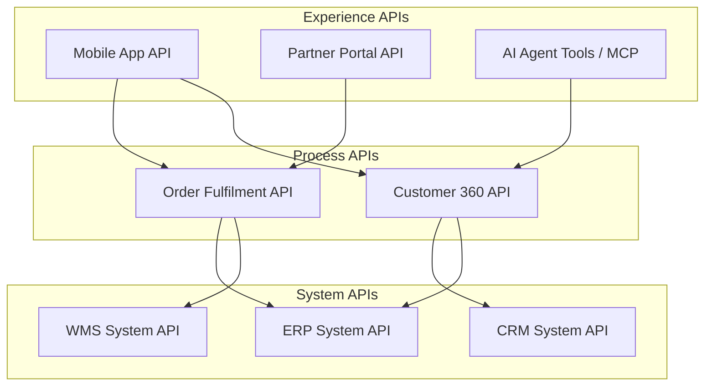

# API-led connectivity

Experience, process and system API layers.

Used in [Chapter 17](../chapters/17-architecture-and-governance.md).

```mermaid
flowchart TB
  subgraph Experience["Experience APIs"]
    E1["Mobile App API"]
    E2["Partner Portal API"]
    E3["AI Agent Tools / MCP"]
  end
  subgraph Process["Process APIs"]
    P1["Order Fulfilment API"]
    P2["Customer 360 API"]
  end
  subgraph System["System APIs"]
    S1["ERP System API"]
    S2["CRM System API"]
    S3["WMS System API"]
  end
  E1 --> P1
  E2 --> P1
  E3 --> P2
  E1 --> P2
  P1 --> S1
  P1 --> S3
  P2 --> S2
  P2 --> S1
```
