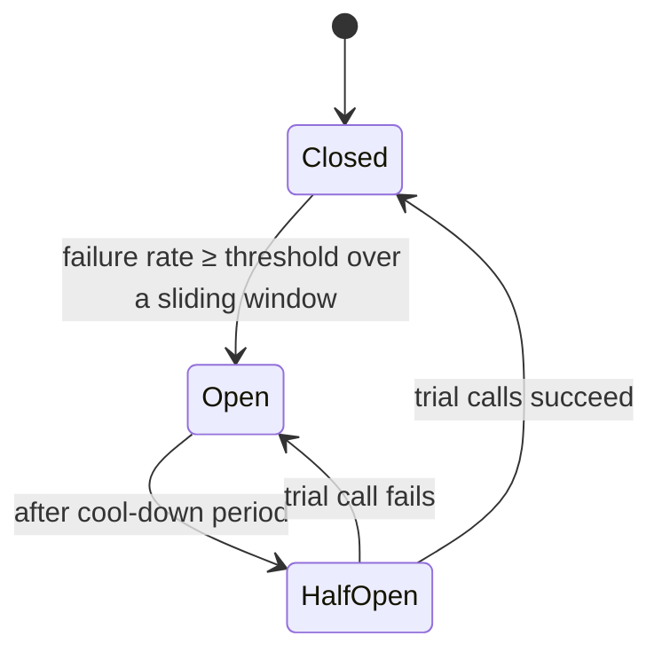

# Circuit breaker states

Closed, open and half-open.

Used in [Chapter 8](../chapters/08-reliability.md).

```mermaid
stateDiagram-v2
  [*] --> Closed
  Closed --> Open: failure rate ≥ threshold over a sliding window
  Open --> HalfOpen: after cool-down period
  HalfOpen --> Closed: trial calls succeed
  HalfOpen --> Open: trial call fails
```
