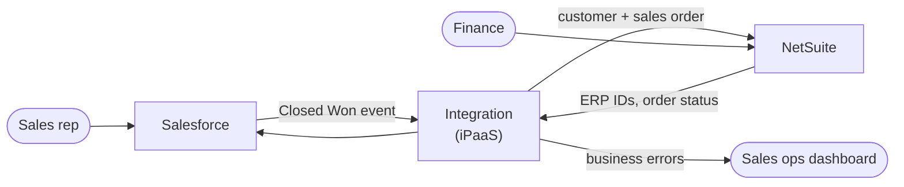

# Context diagram example

Salesforce Closed Won to NetSuite.

Used in [Chapter 14](../chapters/14-design-process.md).

```mermaid
flowchart LR
  Sales([Sales rep]) --> SF["Salesforce"]
  SF -- Closed Won event --> INT["Integration<br/>(iPaaS)"]
  INT -- customer + sales order --> ERP["NetSuite"]
  ERP -- ERP IDs, order status --> INT --> SF
  Fin([Finance]) --> ERP
  INT -- business errors --> Ops([Sales ops dashboard])
```
