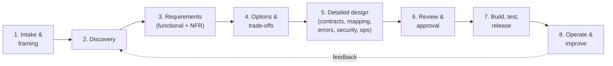

# The integration design process

From intake to operations, with feedback.

Used in [Chapter 14](../chapters/14-design-process.md).

```mermaid
flowchart LR
  A["1. Intake &<br/>framing"] --> B["2. Discovery"]
  B --> C["3. Requirements<br/>(functional + NFR)"]
  C --> D["4. Options &<br/>trade-offs"]
  D --> E["5. Detailed design<br/>(contracts, mapping,<br/>errors, security, ops)"]
  E --> F["6. Review &<br/>approval"]
  F --> G["7. Build, test,<br/>release"]
  G --> H["8. Operate &<br/>improve"]
  H -. feedback .-> B
```
